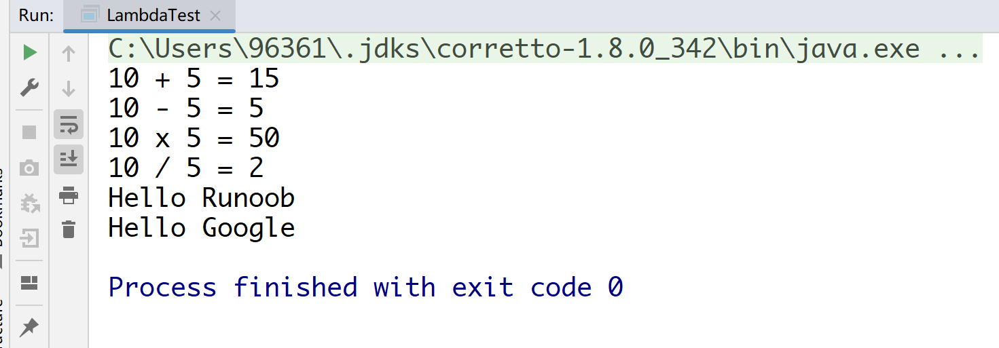
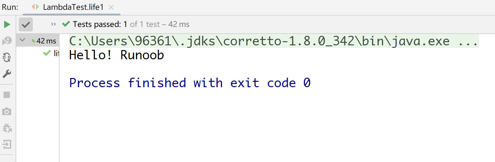
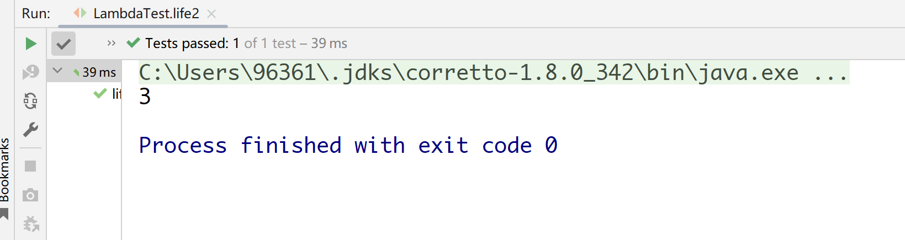

### Lambda 表达式，也可称为闭包，它是推动 Java 8 发布的最重要新特性。
1. Lambda 允许把函数作为一个方法的参数（函数作为参数传递进方法中）。
2. 使用 Lambda 表达式可以使代码变的更加简洁紧凑。


### lambda表达式的重要特征:
1. 可选类型声明：不需要声明参数类型，编译器可以统一识别参数值。
2. 可选的参数圆括号：一个参数无需定义圆括号，但多个参数需要定义圆括号。
3. 可选的大括号：如果主体包含了一个语句，就不需要使用大括号。
4. 可选的返回关键字：如果主体只有一个表达式返回值则编译器会自动返回值，大括号需要指定表达式返回了一个数值。

### 例子
```java
// 1. 不需要参数,返回值为 5  
() -> 5  
  
// 2. 接收一个参数(数字类型),返回其2倍的值  
x -> 2 * x  
  
// 3. 接受2个参数(数字),并返回他们的差值  
(x, y) -> x – y  
  
// 4. 接收2个int型整数,返回他们的和  
(int x, int y) -> x + y  
  
// 5. 接受一个 string 对象,并在控制台打印,不返回任何值(看起来像是返回void)  
(String s) -> System.out.print(s)
```

### 注意事项
1. Lambda 表达式主要用来定义行内执行的方法类型接口，
    1. 例如，一个简单方法接口。
    2. 在上面例子中，我们使用各种类型的Lambda表达式来定义MathOperation接口的方法。然后我们定义了sayMessage的执行。
2. Lambda 表达式免去了使用匿名方法的麻烦，并且给予Java简单但是强大的函数化的编程能力。

### 变量作用域
1. lambda 表达式只能引用标记了 final 的外层局部变量，这就是说不能在 lambda 内部修改定义在域外的局部变量，否则会编译错误。
2. 也可以直接在 lambda 表达式中访问外层的局部变量：
3. lambda 表达式的局部变量可以不用声明为 final，但是必须不可被后面的代码修改（即隐性的具有 final 的语义）
4. 在 Lambda 表达式当中不允许声明一个与局部变量同名的参数或者局部变量。


### 参考代码：
```java
package com.mp.dao;

import org.junit.Test;

public class LambdaTest {
    public static void main(String args[]) {
        LambdaTest tester = new LambdaTest();

        // 类型声明
        MathOperation addition = (int a, int b) -> a + b;

        // 不用类型声明
        MathOperation subtraction = (a, b) -> a - b;

        // 大括号中的返回语句
        MathOperation multiplication = (int a, int b) -> {
            return a * b;
        };

        // 没有大括号及返回语句
        MathOperation division = (int a, int b) -> a / b;

        System.out.println("10 + 5 = " + tester.operate(10, 5, addition));
        System.out.println("10 - 5 = " + tester.operate(10, 5, subtraction));
        System.out.println("10 x 5 = " + tester.operate(10, 5, multiplication));
        System.out.println("10 / 5 = " + tester.operate(10, 5, division));

        // 不用括号
        GreetingService greetService1 = message ->
                System.out.println("Hello " + message);

        // 用括号
        GreetingService greetService2 = (message) ->
                System.out.println("Hello " + message);

        greetService1.sayMessage("Runoob");
        greetService2.sayMessage("Google");
    }

    interface MathOperation {
        int operation(int a, int b);
    }

    interface GreetingService {
        void sayMessage(String message);
    }

    private int operate(int a, int b, MathOperation mathOperation) {
        return mathOperation.operation(a, b);
    }


    final static String salutation = "Hello! ";

    @Test
    public void life1() {
        GreetingService greetService1 = message ->
                System.out.println(salutation + message);
        greetService1.sayMessage("Runoob");
    }

    @Test
    public void life2() {
        final int num = 1;
        Converter<Integer, String> s = (param) -> System.out.println(String.valueOf(param + num));
        s.convert(2);  // 输出结果为 3
    }

    public interface Converter<T1, T2> {
        void convert(int i);
    }


}
```
输出：