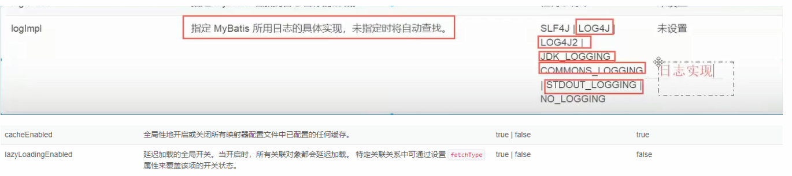
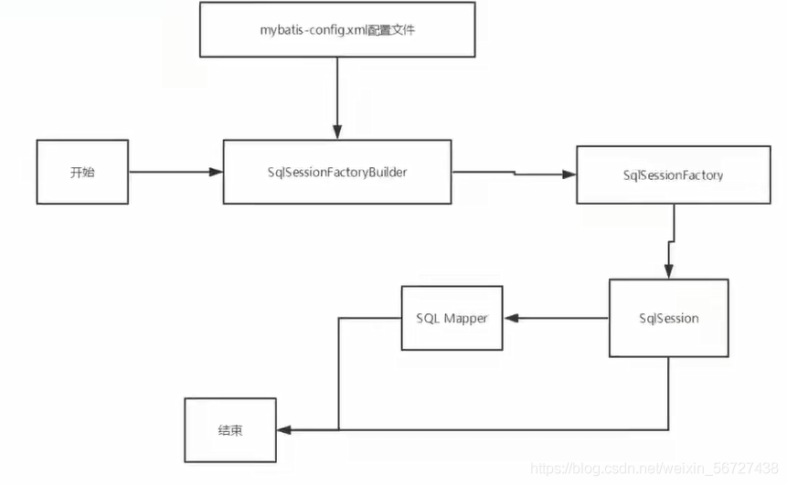
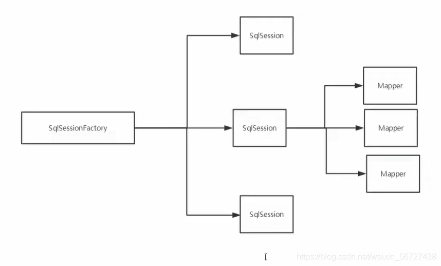
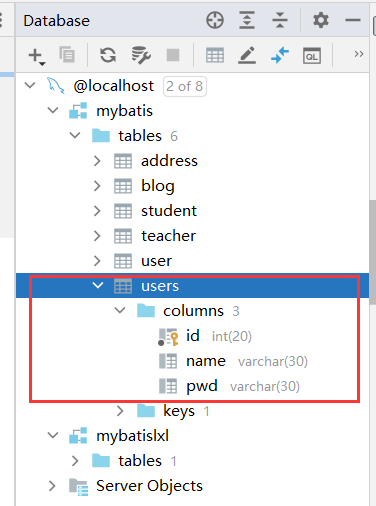
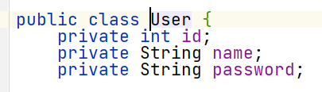
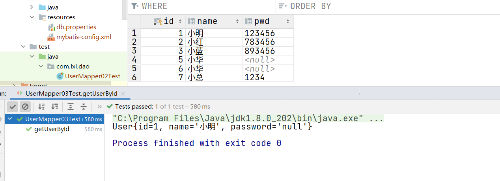
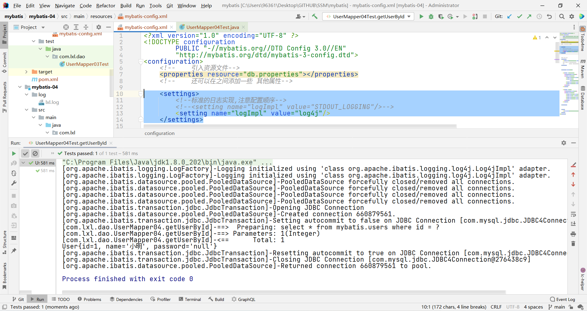

### 1 Mybatis

1. 最好的学习方式：看官方文档。

2. 简介: 什么是 Mybatis
    1. MyBatis 是一款优秀的**持久层框架**
    2. 它支持自定义 SQL、存储过程以及高级映射。
    3. MyBatis 免除了几乎所有的 JDBC 代码以及设置参数和获取结果集的工作。
    4. MyBatis 可以通过简单的 XML 或注解来配置和映射原始类型、接口和 Java POJO（Plain Old Java Objects，普通老式 Java 对象）为数据库中的记录。
    5. [MyBatis](https://baike.baidu.com/item/MyBatis) 本是 apache 的一个 开源项目 iBatis, 2010 年这个项目由 apache software foundation 迁移到了 [google code](https://baike.baidu.com/item/google code/2346604)，并且改名为 MyBatis 。

3. 如何获得 Mybatis？
    1. Maven  
        ```java
        <!-- https://mvnrepository.com/artifact/org.mybatis/mybatis -->
        <dependency>
            <groupId>org.mybatis</groupId>
            <artifactId>mybatis</artifactId>
            <version>3.5.2</version>
        </dependency>
        ```
    2. Github [GitHub - mybatis/mybatis-3: MyBatis SQL mapper framework for Java](https://github.com/mybatis/mybatis-3)
    3. 中文文档 [mybatis – MyBatis 3 | 简介](https://mybatis.org/mybatis-3/zh/index.html)


4. 持久化层
数据持久化  
持久化就是将程序的数据在持久化状态和顺时状态转化的过程  
内存：断电即失  
数据库（Jdbc），io 文件持久化  
生活：冷藏，罐头  
为什么需要持久化？  
有一些对象不能让它丢失  
内存太贵  

5. 持久化层
Dao 层，Service 层，Controller 层  
完成持久化工作的代码  
层界限十分明显  

6. 为什么需要 Mybatis？以及**优点**  
    1. 简单易学：本身就很小且简单。没有任何第三方依赖，最简单安装只要两个 jar 文件 + 配置几个 sql 映射文件。易于学习，易于使用。通过文档和源代码，可以比较完全的掌握它的设计思路和实现。
    2. 灵活：mybatis 不会对应用程序或者数据库的现有设计强加任何影响。 sql 写在 xml 里，便于统一管理和优化。通过 sql 语句可以满足操作数据库的所有需求。
    3. 解除 sql 与程序代码的耦合：通过提供 DAO 层，将业务逻辑和数据访问逻辑分离，使系统的设计更清晰，更易维护，更易单元测试。sql 和代码的分离，提高了可维护性。
    4.  提供映射标签，支持对象与数据库的 orm 字段关系映射。
    5.  提供对象关系映射标签，支持对象关系组建维护。
    6.  提供 xml 标签，支持编写动态 sql。
    7.  使用的人多


### 2 第一个Mybatis程序
思路：搭建环境–> 导入 Mybatis–> 编写代码–> 测试！

1. 搭建环境
    1. 数据库
        ```sql
        CREATE DATABASE `mybatis`;


        CREATE TABLE `users`(
        `id` INT(20) NOT NULL PRIMARY KEY,
        `name` VARCHAR(30) DEFAULT NULL,
        `pwd` VARCHAR(30) DEFAULT NULL

        )ENGINE=INNODB DEFAULT CHARSET=utf8;


        INSERT INTO `users` (`id`,`name`,`pwd`) VALUES
        (1,'小红','123456'),
        (2,'小明','783456'),
        (3,'小蓝','893456');
        ```
    2. 依赖
        ```xml
        <?xml version="1.0" encoding="UTF-8"?>
        <project xmlns="http://maven.apache.org/POM/4.0.0"
                xmlns:xsi="http://www.w3.org/2001/XMLSchema-instance"
                xsi:schemaLocation="http://maven.apache.org/POM/4.0.0 http://maven.apache.org/xsd/maven-4.0.0.xsd">
            <modelVersion>4.0.0</modelVersion>

            <groupId>org.lxl</groupId>
            <artifactId>mybatis</artifactId>
            <packaging>pom</packaging>
            <version>1.0-SNAPSHOT</version>
            <modules>
                <module>mybatis-01</module>
            </modules>

            <properties>
                <maven.compiler.source>8</maven.compiler.source>
                <maven.compiler.target>8</maven.compiler.target>
            </properties>
            <dependencies>
                <!--junit依赖-->
                <dependency>
                    <groupId>junit</groupId>
                    <artifactId>junit</artifactId>
                    <version>4.12</version>
                </dependency>
                <!--mysql依赖-->
                <dependency>
                    <groupId>mysql</groupId>
                    <artifactId>mysql-connector-java</artifactId>
                    <version>5.1.47</version>
                </dependency>
                <!--mybatis依赖-->
                <!-- https://mvnrepository.com/artifact/org.mybatis/mybatis -->
                <dependency>
                    <groupId>org.mybatis</groupId>
                    <artifactId>mybatis</artifactId>
                    <version>3.5.2</version>
                </dependency>
            </dependencies>
            <build>
                <resources>
                    <resource>
                        <directory>src/main/java</directory>
                        <includes>
                            <include>**/*.xml</include>
                            <include>**/*.properties</include>
                        </includes>
                    </resource>

                    <resource>
                        <directory>src/main/resources</directory>
                        <includes>
                            <include>**/*.xml</include>
                            <include>**/*.properties</include>
                        </includes>
                    </resource>
                </resources>
            </build>
        </project>
        ```
2. 创建一个模块
    1. mybatis-config.xml 编写 mybatis 核心配置文件
        ```xml
        <?xml version="1.0" encoding="UTF-8" ?>
        <!DOCTYPE configuration
                PUBLIC "-//mybatis.org//DTD Config 3.0//EN"
                "http://mybatis.org/dtd/mybatis-3-config.dtd">
        <configuration>
            <environments default="development">
                <environment id="development">
                    <transactionManager type="JDBC"/>
                    <dataSource type="POOLED">
                        <property name="driver" value="com.mysql.jdbc.Driver"/>
                        <property name="url"
                                value="jdbc:mysql://localhost:3306/mybatis?useSSL=false&amp;useUnicode=true&amp;characterEncoding=utf-8"/>
                        <property name="username" value="root"/>
                        <property name="password" value="root"/>
                    </dataSource>
                </environment>
            </environments>

            <mappers>
                <mapper resource="com/lxl/dao/UserMapper.xml"/>
            </mappers>

        </configuration>
        ```
    2. MybatisUtils 编写 mybatis 工具类
        ```java
        package com.lxl.utils;
        import org.apache.ibatis.io.Resources;
        import org.apache.ibatis.session.SqlSession;
        import org.apache.ibatis.session.SqlSessionFactory;
        import org.apache.ibatis.session.SqlSessionFactoryBuilder;

        import java.io.IOException;
        import java.io.InputStream;

        //编写 Mybatis 工具类 获取SqlSessionFactory
        public class MybatisUtils {

            private static SqlSessionFactory sqlSessionFactory = null;

            static{//静态代码块封装   从一开始就会加载
                String resource = "mybatis-config.xml";
                try {
                    InputStream inputStream =  Resources.getResourceAsStream(resource);
                    sqlSessionFactory = new SqlSessionFactoryBuilder().build(inputStream);
                } catch (IOException e) {
                    e.printStackTrace();
                }
            }
            //获取sqlSession  对象
            public static SqlSession getSqlSession(){
                return sqlSessionFactory.openSession();
            }
        }
        ```
3. 编写代码
    1. User 编写实体类
        ```java
        package com.lxl.pojo;

        public class User {
            private int id;
            private String name;
            private String pwd;

            public User() {
            }

            public User(int id, String name, String pwd) {
                this.id = id;
                this.name = name;
                this.pwd = pwd;
            }

            public int getId() {
                return id;
            }

            public void setId(int id) {
                this.id = id;
            }

            public String getName() {
                return name;
            }

            public void setName(String name) {
                this.name = name;
            }

            public String getPwd() {
                return pwd;
            }

            public void setPwd(String pwd) {
                this.pwd = pwd;
            }

            @Override
            public String toString() {
                return "User{" +
                        "id=" + id +
                        ", name='" + name + '\'' +
                        ", pwd='" + pwd + '\'' +
                        '}';
            }
        }
        ```
    2. UserMapper 编写接口
        ```java
        package com.lxl.dao;

        import com.lxl.pojo.User;

        import java.util.List;

        public interface UserMapper {
            public abstract List<User> getUserList();
        }
        ```
    3. UserMapper.xml 编写配置文件
        ```xml
        <?xml version="1.0" encoding="UTF-8" ?>
        <!DOCTYPE mapper
                PUBLIC "-//mybatis.org//DTD Mapper 3.0//EN"
                "http://mybatis.org/dtd/mybatis-3-mapper.dtd">


        <!--namespace 命名空间 ： 这里等价于之前缩写的 UserDaoImp  指向一个Mapper接口-->
        <mapper namespace="com.lxl.dao.UserMapper">
            <!--    id 表示的是实现 namespace 中所对应接口的方法   resultType 表示的是返回值类型  -->
            <select id="getUserList" resultType="com.lxl.pojo.User">
                select *
                from mybatis.users
            </select>
        </mapper>
        ```
4. 测试
    ```java
    package com.lxl.dao;

    import com.lxl.pojo.User;
    import com.lxl.utils.MybatisUtils;
    import org.apache.ibatis.session.SqlSession;
    import org.junit.Test;

    import java.util.List;

    public class UserMapperTest {
        @Test
        public void test() {
            //获取 SqlSession 对象
            SqlSession sqlSession = MybatisUtils.getSqlSession();

            //从接口的反射类 获得相应的 mapper
            UserMapper mapper = sqlSession.getMapper(UserMapper.class);
            List<User> userList = mapper.getUserList();

            for (User user : userList) {
                System.out.println(user);
            }
            //关闭资源
            sqlSession.close();
        }
    }
    ```
5. 可能遇到的问题
    1. 配置文件没有配置
    2. 绑定接口错误
    3. 方法名不对
    4. 返回类型不对
    5. Maven 导出资源问题
    6. 数据库连接问题
    7. 标签不要写错
    8. namespace 必须是.
    9. resource 中必须是 / 隔开
    10. 程序配置文件必须符合规范
    11. 空指针异常问题，sqlSessionFactory
    12. 输出的 xml 文件中存在中文乱码问题

### 3 CRUD
1. namespace : namespqce 中的包名要和接口的包名一致。
2. 常规 select, insert, update, delete
    1. id：就是对应的 namespace 中的方法名；
    2. resultType：sql 语句的返回值 类型在包中的位置
    3. parameter：参数类型
    4. 步骤(以select为例):
        1. 编写接口
            ```java
            public interface UserMapper {
                // 查询全部用户
                List<User> getUserList();
            }
            ``` 
        2. 编写 sql 
            ```xml
            <!--namespace 命名空间:这里等价于之前缩写的 UserDaoImp  指向一个Mapper接口-->
            <mapper namespace="com.lxl.dao.UserMapper">
                <!--id 表示的是实现 namespace 中所对应接口的方法
                resultType 表示的是返回值类型  -->
                <select id="getUserList" resultType="com.lxl.pojo.User">
                    select *
                    from mybatis.users
                </select>
            ```
        3. 测试
            ```java
            @Test
            public void test() {
                //获取 SqlSession 对象
                SqlSession sqlSession = MybatisUtils.getSqlSession();
                //从接口的反射类 获得相应的 mapper
                UserMapper mapper = sqlSession.getMapper(UserMapper.class);
                
                List<User> userList = mapper.getUserList();
                for (User user : userList) {
                    System.out.println(user);
                }
                
                //关闭资源
                sqlSession.close();
            }
        ```
3. 万能的 Map : 假设我们实体类或数据库中的字段过多，我们应当考虑使用 Map ,可以用来若干字段CRUD 
    1. 编写接口
        ```java
        // 万能的Map，添加用户
        int addUser2(Map<String, Object> map);
        ```
    2. 编写 sql 
        ```java
        <insert id="addUserByMap" parameterType="map">
            insert into mybatis.users (id, name, pwd)
            values (#{userid}, #{username}, #{userpwd});
        </insert>
        ```
    3. 测试
        ```java
        // 万能Map，增删改需要提交事务
        @Test
        public void addUserByMap() {
            SqlSession sqlSession = MybatisUtils.getSqlSession();
            UserMapper mapper = sqlSession.getMapper(UserMapper.class);

            Map<String, Object> map = new HashMap<>();
            map.put("userid", 6);
            map.put("username", "小华");
            mapper.addUserByMap(map);
            // 提交事务
            sqlSession.commit();

            sqlSession.close();
        }
        ```
    4. 小知识点
        1. Map 传递参数，直接在 sql 中取出 Key 即可
        2. 对象传递参数，直接在 sql 中取对象的即可
        3. 只有一个基本数据类型，可以不写，可以直接在 sql 中取到
        4. 多个参数使用 Map，或者注解
4. 在接口方法的参数前加 @Param 属性
    1. 编写接口
        ```java
        // 根据 密码 和 名字 查询用户
        User getUserByNameandPwd(@Param("username") String username, @Param("pwd") String pwd);

        ```
    2. 编写 SQL 
        ```xml
        <!--根据 密码 和 名字 查询用户-->
        <select id="getUserByNameandPwd" resultType="com.lxl.pojo.User">
            select *
            from mybatis.users
            where name = #{username}
                and pwd = #{pwd}
        </select>
        ```
    3. 测试
        ```java
        //    <!--根据 密码 和 名字 查询用户-->
        @Test
        public void getUserByNameandPwd() {
            SqlSession sqlSession = MybatisUtils.getSqlSession();
            UserMapper mapper = sqlSession.getMapper(UserMapper.class);

            String value = "%蓝%";
            User user = mapper.getUserByNameandPwd("小明", "123456");
            System.out.println(user);
            sqlSession.close();
        }
        ```
5. 模糊查询 like 语句
    1. 编写接口
        ```java
        List<User> getUserLike(String value);
        ```
    2. 编写 SQL 
        ```xml
        <!--防止注入-->
        <select id="getUserLike" resultType="com.lxl.pojo.User">
            select *
            from mybatis.users
            where name like "%"#{value}"%";
        </select>
        ```
    3. 测试
        ```java
        // Like
        @Test
        public void getUserLike() {
            SqlSession sqlSession = MybatisUtils.getSqlSession();
            UserMapper mapper = sqlSession.getMapper(UserMapper.class);

            String value = "%蓝%";
            List<User> userList = mapper.getUserLike(value);
            for (User user : userList) {
                System.out.println(user);
            }
            sqlSession.close();
        }
        ```
6. 小结:
    1. 所有的增删改操作都需要**提交事务**！
    2. 接口所有的普通参数，尽量都写上 @Param 参数，尤其是多个参数时，必须写上！
    3. 有时候根据业务的需求，可以考虑使用 map 传递参数！
    4. 为了规范操作，在 SQL 的配置文件中，我们尽量将 Parameter 参数和 resultType 都写上！

### 4 配置解析
1. 核心配置文件
    1. mybatis-config.xml  
    2. MyBatis 的配置文件包含了会深深影响 MyBatis 行为的设置和属性信息。
    3.   
            configuration（配置）
            properties（属性）
            settings（设置）
            typeAliases（类型别名）
            typeHandlers（类型处理器）
            objectFactory（对象工厂）
            plugins（插件）
            environments（环境配置）
            environment（环境变量）
            transactionManager（事务管理器）
            dataSource（数据源）
            databaseIdProvider（数据库厂商标识）
            mappers（映射器）
    4. 还要**注意元素节点的顺序！如果顺序不对会报错**
2. environments 元素
    1. 配置 MyBatis 的多套运行环境，将 SQL 映射到多个不同的数据库上
    2. 必须指定其中一个为默认运行环境（通过 default 指定）
    3. dataSource 元素使用标准的 JDBC 数据源接口来配置 JDBC 连接对象的资源。数据源是必须配置的。
    4. 有三种内建的数据源类型
        1. type="[UNPOOLED|POOLED|JNDI]"）
        2. unpooled：这个数据源的实现只是每次被请求时打开和关闭连接。
        3. pooled：这种数据源的实现利用 “池” 的概念将 JDBC 连接对象组织起来，这是一种使得并发 Web 应用快速响应请求的流行处理方式。
        4. jndi：这个数据源的实现是为了能在如 Spring 或应用服务器这类容器中使用，容器可以集中或在外部配置数据源，然后放置一个 JNDI 上下文的引用。
    5. 数据源也有很多第三方的实现，比如 dbcp，c3p0，druid 等等....
    6. 事务管理器有两种:[ JDBC | MANAGED ]
    7. db.properties 编写配置文件
        ```xml
        driver=com.mysql.jdbc.Driver
        url=jdbc:mysql://localhost:3306/mybatis?useUnicode=true&characterEncoding=UTF-8&useSSL=true
        username=root
        password=root
        ```

        ```xml
        <!--    引入资源文件-->
        <properties resource="db.properties"></properties>
        <!--    还可以在之间添加一些 其他属性-->

        <environments default="test">
            <environment id="test">
                <transactionManager type="JDBC"/>
                <dataSource type="POOLED">
                    <property name="driver" value="${driver}"/>
                    <property name="url" value="${url}"/>
                    <property name="username" value="${username}"/>
                    <property name="password" value="${password}"/>
                </dataSource>
            </environment>
        </environments>
        ```
3. 属性（properties）
    1. 我们可以通过 properties 属性实现引用配置文件
    2. 这些属性可以在外部进行配置，并可以进行动态替换。你既可以在典型的 Java 属性文件中配置这些属性，也可以在 properties 元素的子元素中设置。[db.properties]
        ```xml
        <!--    引入资源文件-->
            <properties resource="db.properties"></properties>
        <!--    还可以在之间添加一些 其他属性-->
        ```
    3. 可以直接引入外部文件
    4. 可以在其中增加一些属性配置
    5. 如果两个文件有同一个字段，优先使用外部文件配置文件的。
4. 类别名和包别名
    1. 类别名:降低冗余的全限定类名书写
    2. 包别名: Mybatis 会在包名下面搜索需要的 JavaBean，比如扫描实体类的包，他的默认别名就是这个类的类名，**首字母小写**！
    3. 在实体比较少的时候，使用第一种方式
    4. 如果实体类十分多，建议使用第二种
    5. 第一种可以 DIY 别名，第二种则不行，如果非要改，需要在实体类上增加注解。
        ```xml
        <!--配置别名,注意顺序-->
        <typeAliases>
            <typeAlias type="com.lxl.pojo.User" alias="User"/>
            <!--包扫描+User上面加注解@Alias("hello")-->
            <package name="com.lxl.pojo"/>
        </typeAliases>
        ```

        ```java
        @Alias("hello")
        public class User {

        }
        ```
5. 设置  
    1. 这是 Mybatis 中极为重要的调整设置，他们会改变 Mybatis 的运行是行为。
6. 其他配置  
    1. typeHandlers（类型处理器）
    2. objectFactory（对象工厂）
    3. plugins（插件）
        1. [-mybatis-plus](https://baomidou.com/)
        2. -通用mapper
        3. -mybatis-generator-core

7. 映射器（mappers）
    1. 方式一：使用相对于类路径的资源引用
        ```xml
        <mappers>
                <mapper resource="com/xiao/Dao/UserMapper.xml"/>
        <!-- 2.这里的映射路径  映射的是一个xml文件 所以前面的路径指代 是用/隔开       -->
        </mappers>
        ```
    2. 方式二：使用映射器接口实现类的完全限定类名
        ```xml
        <mappers>
                <mapper class="com.xiao.Dao.UserMapper"/>
        <!-- 2.这里的映射路径  映射的是一个xml文件 所以前面的路径指代 是用/隔开       -->
        </mappers>
        ```
        注意点：

        接口和他的 Mapper 配置文件必须同名  
        接口和他的配置文件必须在同一个包下  
    3. 方式三：将包内的映射器接口实现全部注册为映射器  
        ```xml
        <mappers>
                <package name="com.xiao.Dao"/>
        <!-- 2.这里的映射路径  映射的是一个xml文件 所以前面的路径指代 是用/隔开       -->
        </mappers>
        ```
        注意点：

        接口和他的 Mapper 配置文件必须同名  
        接口和他的配置文件必须在同一个包下
8. **生命周期和作用域**

不同作用域和生命周期类别是至关重要的，因为错误的使用会导致非常严重的并发问题。
    1. SqlSessionFactoryBuilder：
        1. 一旦创建了 SqlSessionFactory，就不再需要它了
        2. 局部变量
    2. SqlSessionFactory：
        1. 说白了就是可以想象为：数据库连接池
        2. SqlSessionFactory 一旦被创建就应该在应用的运行期间一直存在，没有任何理由丢弃它或重新创建另一个实例。
        3. 因此 SqlSessionFactory 的最佳作用域是应用作用域。
        4. 最简单的就是使用单例模式或者静态单例模式。
    3. SqlSession
        1. 连接到连接池的一个请求！
        2. SqlSession 的实例不是线程安全的，因此是不能被共享的，所以它的最佳的作用域是请求或方法作用域。
        3. 用完之后需要赶紧关闭，否则资源被占用！

   
### 5 解决属性名和字段名不一致的问题
1. 问题
    1. 数据库中的字段:
    2. 实体类(没有一一对应):
    3. 出现的问题:会报错
    4. 简单粗暴的解决办法:起别名：
        ```xml
        <select id="getUserById" resultType="user">
            select id,name,pwd as password from mybatis.users where id=#{id}
        </select>
        ```
2. `resultMap`是更好的解决方法:
    1. 编写接口
        ```java
        public interface UserMapper03 {
            // 根据ID查询用户
            User getUserById(int id);
        }
        ```
    2. 编写User类
        ```java
        public class User {
            private int id;
            private String name;
            private String password;
            ...
        }
        ```
    3. **编写SQL**:
        注意column 表示的是 数据库中的列  property表示的是属性
        ```xml
        <mapper namespace="com.lxl.dao.UserMapper03">
            <resultMap id="getUserById" type="user">
                <!--可省略-->
                <result column="id" property="id"></result>
                <!--可省略-->
                <result column="name" property="name"></result>
                <!--不可省略-->
                <result column="pwd" property="password"></result>
            </resultMap>
            <select id="getUserById" resultType="user">
                select *
                from mybatis.users
                where id = #{id}
            </select>
        </mapper>
        ```
    4. 测试
        ```java
        public class UserMapper03Test {
            @Test
            public void getUserById() {
                SqlSession sqlSession = MybatisUtils.getSqlSession();
                UserMapper03 mapper = sqlSession.getMapper(UserMapper03.class);
                User user = mapper.getUserById(1);
                System.out.println(user);
                sqlSession.close();
            }
        }
        ``` 
    5. 结果:
    6. 总结:
        1. resultMap 元素是 MyBatis 中最重要最强大的元素。
        2. ResultMap 的设计思想是，对简单的语句做到零配置，对于复杂一点的语句，只需要描述语句之间的关系就行了。
        3. 在学习了上面的知识后，你会发现上面的例子没有一个需要显式配置 ResultMap，这就是 ResultMap 的优秀之处 —— 你完全可以不用显式地配置它们
        4. 如果这个世界总是这么简单就好了。

   
   
   


### 6 日志工厂
1. 日志工厂
    1. 如果一个数据库操作，出现了异常，我们需要排错。日志就是最好的助手！
    2. 曾经：sout、debug
    3. 现在：日志工厂！
SLF4J  
LOG4J 【掌握】  
LOG4J2  
JDK_LOGGING  
COMMONS_LOGGING  
STDOUT_LOGGING 【掌握】  
NO_LOGGING  
2. STDOUT_LOGGING
    ```xml
    <settings>
        <!--标准的日志实现,注意配置顺序-->
        <setting name="logImpl" value="STDOUT_LOGGING"/>
    </settings>
    ```
3. LOG4J
    1. 什么是 Log4j？
        1. Log4j 是 Apache 的一个开源项目，通过使用 Log4j，我们可以控制日志信息输送的目的地是 控制台、文件、 GUI 组件
        2. 我们也可以控制每一条日志的输出格式；
        3. 通过定义每一条日志信息的级别，我们能够更加细致地控制日志的生成过程。
        4. 这些可以通过一个配置文件来灵活地进行配置，而不需要修改应用的代码。
    2. 先导入 Log4j 包
        ```xml
        <!-- https://mvnrepository.com/artifact/log4j/log4j -->
        <dependency>
            <groupId>log4j</groupId>
            <artifactId>log4j</artifactId>
            <version>1.2.17</version>
        </dependency>
        ```
    3. log4j.properties
        ```xml
        #将等级为DEBUG的日志信息输出到console和file这两个目的地，console和file的定义在下面的代码
        log4j.rootLogger=DEBUG,console,file
        #控制台输出的相关设置
        log4j.appender.console=org.apache.log4j.ConsoleAppender
        log4j.appender.console.Target=System.out
        log4j.appender.console.Threshold=DEBUG
        log4j.appender.console.layout=org.apache.log4j.PatternLayout
        log4j.appender.console.layout.ConversionPattern=[%c]-%m%n
        #文件输出的相关设置
        log4j.appender.file=org.apache.log4j.RollingFileAppender
        log4j.appender.file.File=./log/lxl.log
        log4j.appender.file.MaxFileSize=10mb
        log4j.appender.file.Threshold=DEBUG
        log4j.appender.file.layout=org.apache.log4j.PatternLayout
        log4j.appender.file.layout.ConversionPattern=[%p][%d{yy-MM-dd}][%c]%m%n
        #日志输出级别
        log4j.logger.org.mybatis=DEBUG
        log4j.logger.java.sql=DEBUG
        log4j.logger.java.sql.Statement=DEBUG
        log4j.logger.java.sql.ResultSet=DEBUG
        log4j.logger.java.sql.PreparedStatement=DEBUG
        ```
    4. Log4j 的配置
        ```xml
        <settings>
            <!--标准的日志实现,注意配置顺序-->
            <!--<setting name="logImpl" value="STDOUT_LOGGING"/>-->
            <setting name="logImpl" value="log4j"/>
        </settings>
        ```
    5. 查询测试
    6. 简单使用
        ```java
        public class UserMapper04Test {

            static Logger logger = Logger.getLogger(UserMapper04Test.class);
            @Test
            public void log4jtest() {

                logger.info("info:进入了info");
                logger.error("error:进入了error");
                logger.debug("debug:进入了debug");

            }
        }
        ```

### 7 分页
0. 思考：为什么需要分页？减少数据的处理量
1. 使用 limit 分页,语法：
    ```sql
    select * from users limit startindex pagesize
    select * from users limit 3 #[0,3]
    ```
2. 使用 mybatis 分页
    1. 编写接口
        ```java
        // mybatis实现分页
        List<User> getUserListByLimit(Map<String, Integer> map);
        ```
    2. 编写 SQL 
        ```xml
        <!--实现分页-->
        <select id="getUserListByLimit" parameterType="map" resultMap="UserMap">
            select *
            from mybatis.users
            limit #{startIndex},#{pageSize}
        </select>
        ```
    3. 测试
        ```java
        //实现分页测试
        @Test
        public void getUserListByLimit() {
            SqlSession sqlSession = MybatisUtils.getSqlSession();

            UserMapper04 mapper = sqlSession.getMapper(UserMapper04.class);

            HashMap<String, Integer> map = new HashMap<>();
            map.put("startIndex", 0);
            map.put("pageSize", 2);
            List<User> userList = mapper.getUserListByLimit(map);

            for (User user : userList) {
                System.out.println(user);
            }

            sqlSession.close();
        }
        ``` 

### 8 使用注解开发
1. 面向接口编程
    - 大家之前都学过面向对象编程，也学习过接口，但在真正的开发中，很多时候我们会选择面向接口编程
    - 根本原因：解耦，可拓展，提高复用，分层开发中，上层不用管具体的实现，大家都遵守共同的标准，使得开发变得更容易，规范性更好
    - 在一个面向对象的系统中，系统的各种功能是由许许多多的不同对象协作完成的。在这种情况下，各个对象内部是如何实现自己的，对系统设计人员来讲就不那么重要了；
    - 而各个对象之前的协作关系则成为系统设计的关键，小到不同类之间的通信，大到各模块之间的交互，在系统设计之初都是要着重考虑的，这也是系统设计的主要工作内容，面向接口编程就是指按照这种思想来编程。关于接口的理解

    - 接口从更深层次的理解，应是定义（规范，约束）与实现（名实分离）的分离。
    - 接口的本身反映了系统设计人员对系统的抽象理解。

    - 接口应有两类：
        - 第一类是对一个个体的抽象，它可对应为一个抽象体 (abstract class);
        - 第二类是对一个个体某一方面的抽象，即形成一个抽象面 (interface)；
    - 一个体有可能有多个抽象面，抽象体与抽象面是有区别的
2. 三个面向区别
    - 面向对象是指，我们考虑问题时，以对象为单位，考虑它的属性及方法
    - 面向过程是指，我们考虑问题时，以一个具体的流程 (事务过程) 为单位，考虑它的实现。
    - 接口设计与非接口设计是针对复用技术而言的，与面向对象 (过程) 不是一个问题，更多的体现就是对系统整体的架构

3. 举例
    1. 编写接口和上面的@Select注解SQL
        ```java
        @Select("select * from mybatis.users")
        List<User> getUserList();
        ```
    2. Mapper 映射 
        ```xml
        <mappers>
            <!--<mapper resource="com/lxl/dao/UserMapper05.xml"/>-->
            <mapper class="com.lxl.dao.UserMapper05"></mapper>
        </mappers>
        ```
    3. 测试
        ```java
        @Test
        public void getUserById2() {
            SqlSession sqlSession = MybatisUtils.getSqlSession();
            UserMapper05 mapper = sqlSession.getMapper(UserMapper05.class);
            List<User> user = mapper.getUserList();
            for (User peruser : user) {
                System.out.println(peruser);
            }
            sqlSession.close();
        }
        ``` 
4. 本质：**反射**机制实现
5. 底层：动态代理！

6. CRUD
    ```java
    @Insert("insert into mybatis.users (id,name,pwd) values(#{id},#{name},#{pwd})")
    int insertUser(User user);

    @Delete("delete from mybatis.users where id = #{id}")
    int deleteUser(@Param("id") int id);

    @Update("update mybatis.users set name=#{name},pwd=#{pwd} where id=#{id}")
    int updateUser(User user);

    @Select("select * from mybatis.users where id=#{id}")
    User getUserById(@Param("id") int id);
    ```

    ```java
    // 使用不同的名字,也可以对应,只需要取值正确即可
    public class User {
    private int id;
    private String name;
    private String password;
    ...
    }

    // 获取sqlSession  对象
    public static SqlSession getSqlSession() {
        return sqlSessionFactory.openSession(true);
    }

    @Insert("insert into mybatis.users (id,name,pwd) values (#{id},#{name},#{password})")
    int insertUser(User user);
    ```

7. 关于 @Param () 注解
    1. 基本类型的参数或者 String 类型，需要加上
    2. 引用类型不需要加上
    3. 如果只有一个基本数据类型的话，可以忽略，但是建议加上！
    4. 我们在 SQL 中引用的就是我们这里的 @Param () 中设定的属性名
    5. #{} 和 ${} 的区别
### 9 Lombok