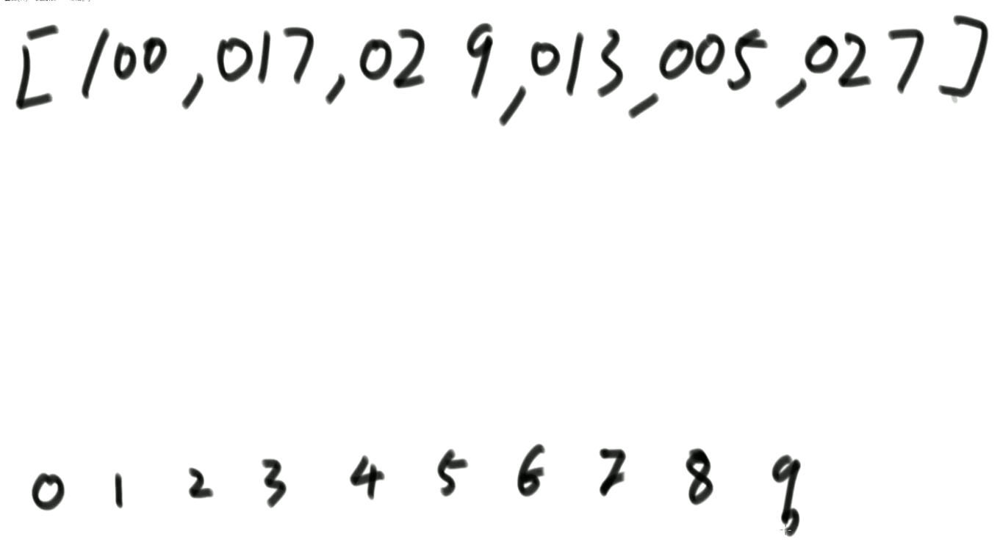

1. 上一节中从上往下(heapinsert方法)调整和从下往上(heapify)调整为什么时间复杂度不一样呢？
    - 从上到下的方法，时间复杂度为O(N*logN)；从下到上的方法，时间复杂度为O(N)；
    - 从上往下：上面结点数量少，代价少；下面结点数量多，代价大；
    - 从下往上：上面结点数量少，代价多；下面结点数量多，代价小；

## Trie结构 前缀树结构(代价O(N))
1. 经典的是只封装p值和e值,也可以封装更丰富的信息,如果一道题有前缀查询的特征,前缀树就可以通过增加更多信息的方式支持这道题更快做完
2. 建立方法：
    - 单个字符串中，字符从前到后的加到一颗多叉树上；
    - 字符放在路上，结点上有专属的数据项（常见的是pass和end值）；
    - 所有样本都这样添加，如果没有路就新建，如有路就复用；
    - 沿途结点的pass值增加1，每个字符串结束时来到的结点end值增加1。

## 不基于比较的排序——桶排序
1. 桶排序思想下的排序：**计数排序**和**基数排序**
2. 桶排序思想下的排序都是**不基于比较的排序**；
3. 时间复杂度为O(N)，额外空间复杂度为O(M)，看你准备多少个桶；
4. 应用范围有限，需要样本的数据状况满足桶的划分。
5. 计数排序：样本是整数，而且范围比较窄
6. 基数排序：样本是10进制的正整数
    1. 0~9有10个桶,先进先出(队列)
    2. (先个位进桶,再出桶,再十位,再百位)
    3. 先按个位情况排个序,再用十位情况排序,再用百位排序

## 排序算法的稳定性
1. 稳定性是指同样大小的样本再排序之后不会改变相对次序；
2. 对于**基础类型**来说，稳定性的概念毫无意义；
3. 对于**非基础类型**来说，稳定性有重要的意义。
    1. 价格从低到高
    2. 好评度从好到差
    3. 得到物美价廉
4. 有些排序算法可以实现成稳定的，而有些排序算法无论如何都实现不成稳定的。
5. 选择排序,无法稳定
6. 冒泡排序,关于相等值的处理,决定了稳定性(相等时不交换)
7. 插入排序,关于相等值的处理,决定了稳定性(相等时不交换)
8. 归并排序,关于相等值的处理,决定了稳定性(相等时先拷贝左边的)
9. 快速排序,无法稳定,partition就无法稳定
10. 堆不稳定,人家不管这事

## 排序算法的总结
1. 不基于比较的排序，对于样本数据有严格要求，不容易改写；
2. 基于比较的排序，只要规定好两个样本怎么比大小就可以直接复用；
3. 基于比较的排序，时间复杂度的极限是O(N*logN)；
4. 时间复杂度O(N*logN)、额外空间复杂度低于O(N)、且稳定的基于比较的排序是不存在的。
5. 为了绝对的**速度选快排**，**为了省空间选堆排**，**为了稳定选归并**。
6. 额外空间复杂度
    1. 归并排序需要准备额外空间做merge
    2. 随机快排,根据每种情况权重只占1/n算的长期期望

### 排序算法的常见坑
1. 归并排序的额外空间复杂度可以变成O(1)：“归并排序：内部缓存法”，但是将变得不再稳定。（为什么不直接用堆呢？）
2. “原地归并排序”是垃圾贴，会让时间复杂度变成O(N^2)；（写成插排不可以吗？没有意义）
3. 快速排序稳定性改进，“01 stable sort”，但是会对样本数据要求更多。
4. 在整型数组中，请把奇数放在数组左边，偶数放在数组右边，要求所有奇数之间原始的相对次序不变，要求所有偶数之间原始相对次数不变。时间复杂度要求做到O(N)，额外空间复杂度做到O(1)。**（他是个01标准的partition，但是快排经典的partition是做不到稳定性的，如果能做到它为什么不做到呢？）**

## 工程上对排序的改进
1. 稳定性的考虑
    1. 看是以值传递还是引用传递，如果是值，直接快排；如果是引用，则利用归并排序。
2. 充分利用O(N*logN)和O(N^2)排序各自的优势
    1. 快排/归并/堆,O(N*logN),调度优秀,常数项大
    2. 考虑不同排序算法的常数项时间，有的算法数据量一上去，常数项时间就上去了，
    3. 但是有的算法数据虽然时间复杂度为O(N^2)，但是常数时间很少。
