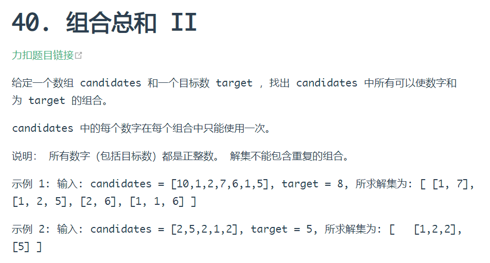
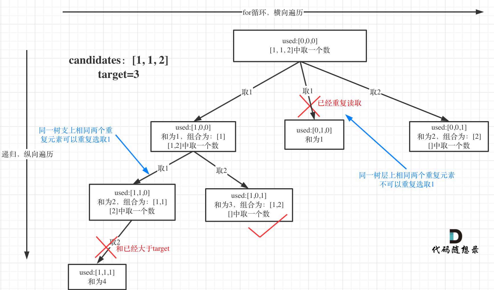
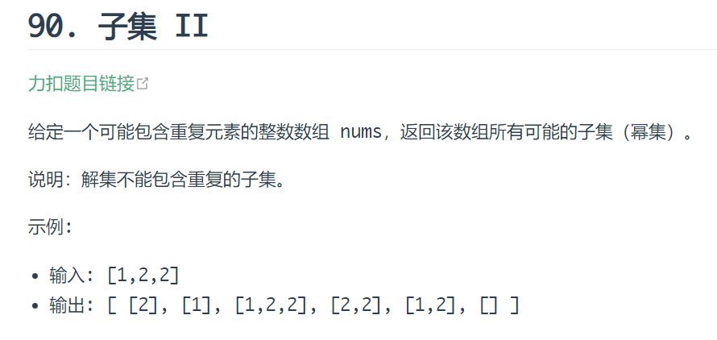
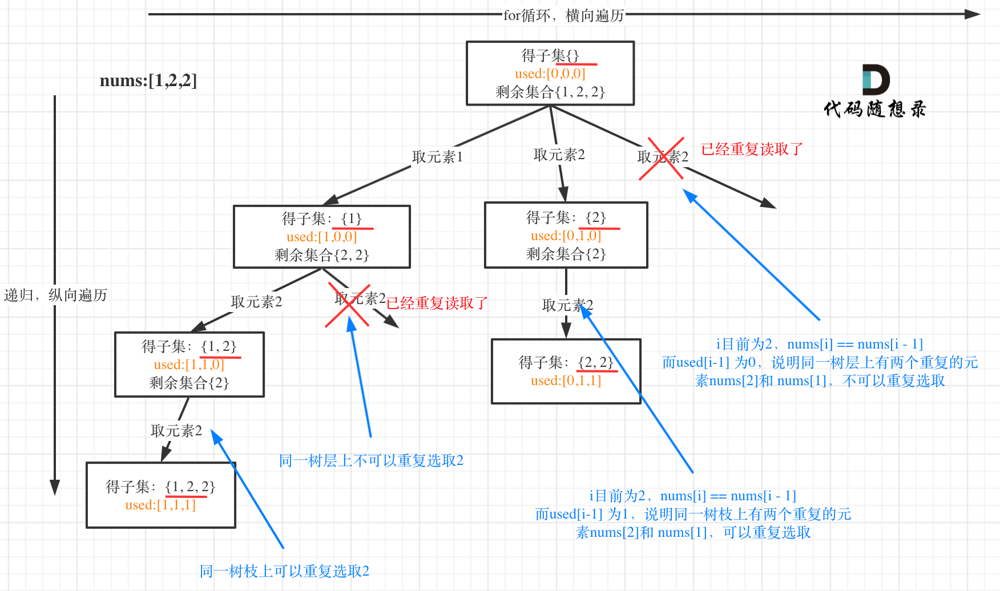
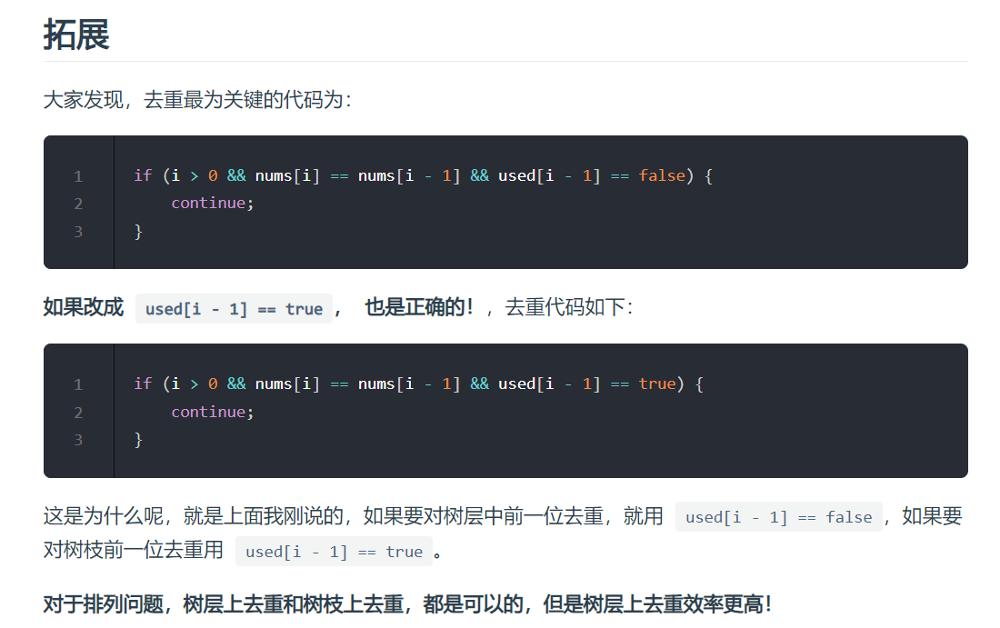

### 回溯三部曲
1. **回溯函数模板返回值以及参数**
    1. 习惯是函数起名字为`backtracking`
    2. 函数返回值一般为`void`
    3. 一般是先写逻辑，然后需要什么参数，就填什么参数。
    4. 回溯函数伪代码如下：
        ```java
        void backtracking(参数)
        ```
2. **回溯函数终止条件**
    1. 回溯函数终止条件伪代码如下：
        ```java
        if (终止条件) {
            存放结果;
            return;
        }
        ```
3. **回溯搜索的遍历过程**
    1. 回溯函数遍历过程伪代码如下：
        ```java
        for (选择：本层集合中元素(树中节点孩子的数量就是集合的大小)) {
            处理节点;
            backtracking(路径，选择列表); // 递归
            回溯，撤销处理结果
        }
        ```
    2. for 循环可以理解是横向遍历:
        1. for 循环就是遍历集合区间，可以理解一个节点有多少个孩子，这个 for 循环就执行多少次。
    3. backtracking(递归)就是纵向遍历
        1. backtracking 这里自己调用自己，实现递归。
4. **回溯算法模板框架**
    ```java
    void backtracking(参数) {
        if (终止条件) {
            存放结果;
            return;
        }
        for (选择：本层集合中元素(树中节点孩子的数量就是集合的大小)) {
            处理节点;
            backtracking(路径，选择列表); // 递归
            回溯，撤销处理结果
        }
    }
    ```


### 回溯法解决的问题
组合问题：N 个数里面按一定规则找出 k 个数的集合
切割问题：一个字符串按一定规则有几种切割方式
子集问题：一个 N 个数的集合里有多少符合条件的子集
排列问题：N 个数按一定规则全排列，有几种排列方式
棋盘问题：N 皇后，解数独等等


### 本题还需要 startIndex 来控制 for 循环的起始位置，对于组合问题，什么时候需要 startIndex 呢？
我举过例子，如果是一个集合来求组合的话，就需要 startIndex，例如：77. 组合 ，216. 组合总和 III 。

如果是多个集合取组合，各个集合之间相互不影响，那么就不用 startIndex，例如：17. 电话号码的字母组合

注意以上我只是说求组合的情况，如果是排列问题，又是另一套分析的套路，后面我再讲解排列的时候就重点介绍。

### 用递归控制 for 循环嵌套的数量！
**把回溯问题抽象为树形结构，可以直观的看出其搜索的过程：for 循环横向遍历，递归纵向遍历，回溯不断调整结果集。**

### 剪枝优化
把问题抽象为一个树形结构，可以看到需要剪枝的部分
**剪枝精髓**是：for 循环在寻找起点的时候要有一个范围，如果这个起点到集合终止之间的元素已经不够 题目要求的 k 个元素了，就没有必要搜索了。

### 求子集问题和 77. 组合 和 131. 分割回文串 又不一样
1. 如果把 子集问题、组合问题、分割问题都抽象为一棵树的话，那么组合问题和分割问题都是收集树的叶子节点，而子集问题是找树的所有节点！
2. 其实子集也是一种组合问题，因为它的集合是无序的，子集 {1,2} 和 子集 {2,1} 是一样的。
3. 那么既然是无序，取过的元素不会重复取，写回溯算法的时候，for 就要从 startIndex 开始，而不是从 0 开始！
4. 什么时候 for 可以从 0 开始呢？
    1. 求排列问题的时候，就要从 0 开始，因为集合是有序的，{1, 2} 和 {2, 1} 是两个集合
5. 子集是收集树形结构中树的所有节点的结果。
6. 而组合问题、分割问题是收集树形结构中叶子节点的结果。

### 求组合的情况
1. 如果是一个集合来求组合的话，就需要 startIndex，
    1. 例如：回溯算法：求组合问题！， 回溯算法：求组合总和！ 。
2. 如果是多个集合取组合，各个集合之间相互不影响，那么就不用 startIndex，
    1. 例如：回溯算法：电话号码的字母组合

### 理解 “树层去重” 和 “树枝去重” 非常重要。
难点在于 集合（数组 candidates）有重复元素，但还不能有重复的组合。
1. 一些同学可能想了：我把所有组合求出来，再用 set 或者 map 去重，这么做很容易超时！
2. 所以要在搜索的过程中就去掉重复组合。
3. 去重，其实就是使用过的元素不能重复选取
4. 组合问题可以抽象为树形结构，那么 “使用过” 在这个树形结构上是有两个维度的，
    1. 一个维度是同一树枝上使用过，
    2. 一个维度是同一树层上使用过
5. 例题1:
    1. 回看一下题目，元素在同一个组合内是可以重复的，怎么重复都没事，但两个组合不能相同。
    2. 所以我们要去重的是同一树层上的 “使用过”，同一树枝上的都是一个组合里的元素，不用去重。
    3. 为了理解去重我们来举一个例子，candidates = [1, 1, 2], target = 3，（方便起见 candidates 已经排序了）
    4. 强调一下，树层去重的话，需要对数组排序！
    5. 选择过程树形结构如图所示：
    6. 加一个 bool 型数组 used，用来记录同一树枝上的元素是否使用过。这个集合去重的重任就是 used 来完成的。
    7. 也就是说,**树层去重:for循环中需要对重复值进行continue,递归时不需要**
6. 例题2:
    1. 同样也是**树层去重**
    2. 

### 数组，set，map 都可以做哈希表，而且数组干的活，map 和 set 都能干，但如果数值范围小的话能用数组尽量用数组。


### 如果要对树层中前一位去重，就用 used[i - 1] == false，如果要对树枝前一位去重用 used[i - 1] == true。



### 之前讲解回溯算法的时候，一般函数返回值都是 void，这次为什么是 bool 呢？
因为我们只需要找到一个行程，就是在树形结构中唯一的一条通向叶子节点的路线