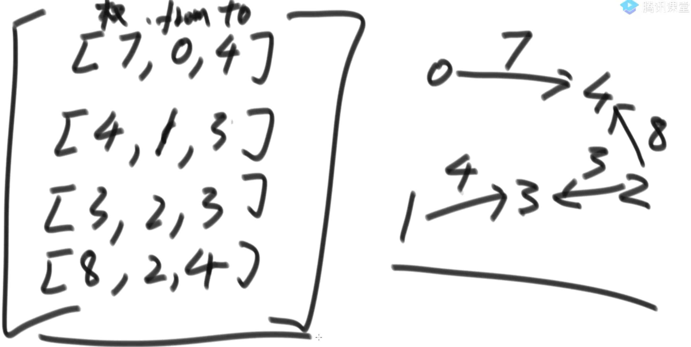

## 图相关算法
1. 图的概念
    1. 由点的集合和边的集合构成
    2. 虽然存在有向图和无向图的概念，
        1. 但实际上都可以用有向图来表达
        2. 无向图可以理解为两个联通点互相指向
    3. 边上可能带有权值
2. 图的表示方法(连接与否,权重)
    1. 邻接表表示法(代价可封装上去)
        1. 从A点出发能到的直接邻居
    2. 邻接矩阵表示法(全连接)
        1. 列二维表格,表格中填写权重,如果AB不相邻,就是正无穷
    3. 其他方式
    4. 笔试面试常见结构:边的权重，从from节点指向to节点
    5. 图的结构有很多,我们确定一种自己熟悉的图结构,以不变应万变,无论来的什么结构,写一个转换类,任意图结构的描述,都向我们上述的图结构转化：
3. **大一统图图**
    1. 点结构的描述：
    2. 边结构的描述：
    3. 图结构的描述：
4. 图算法并不难，难点在于图有很多种表示方式，表达一张图的篇幅比较大，coding容易出错。我们的套路就是
    1. 先用自己最熟练的方式，实现图结构的表达
    2. 在自己熟悉的结构上，实现所有常用的图算法作为模板
    3. 把面试题提供的图结构转化为自己熟悉的图结构，再调用模板或改写即可

### 图的遍历
#### 宽度优先遍历BFS
1. (`Code01_BFS`)
    1. 利用队列实现
    2. 从源节点开始依次按照宽度进队列，然后弹出
    3. 每弹出一个点，把该节点所有没有进过队列的邻接点放入队列
    4. 直到队列变空
2. 宽度优先的思路：实质先遍历自己，再遍历自己的下一跳节点(同一层节点的顺序无需关系)，再下下跳节点…
3. 步骤实现:我们从A点开始遍历：
    1. A进队列–> Q[A]；A进入Set–> S[A]
    2. A出队：Q[],打印A；A直接邻居为BCD,都不在Set中，进入队列Q[D,C,B], 进入S[A,B,C,D]
    3. B出队：Q[D,C], B有CE三个邻居，C已经在Set中, 放入E, S[A,B,C,D,E]，队列放E, Q[E,D,C]
    4. C出队，周而复始
#### 深度优先遍历DFS
1. `Code02_DFS`
    1. 利用栈实现
    2. 从源节点开始把节点按照深度放入栈，然后弹出  
    3. 每弹出一个点，把该节点下一个没有进过栈的邻接点放入栈
    4. 直到栈变空
2. 深度优先思路：表示从某个节点一直往下深入，知道没有路了，返回。我们的栈实质记录的是我们深度优先遍历的路径
3. 步骤实现:我们从A点开始遍历：
    1. A进栈，Stack[A] 打印A。弹出A，当前弹出的节点A去枚举它的后代BCD，B没加入过栈中。压入A再压入B,Stack[B,A]。打印B
    2. 弹出B,B的直接后代邻居为CE,C再栈中而E不在栈中。重新压B,压E，Stack[E,B,A]。打印E
    3. 弹出E,E有邻居D,D不在栈中。压回E，再压D,此时Stack[D,E,B,A]。打印D
    4. 弹出D,D的直接邻居是A,A已经在栈中了。说明A-B-E-D这条路径走到了尽头。弹出D之后，当前循环结束。继续while栈不为空，重复操作


### 图的拓扑排序
1. 解释:当前工作需要依赖之前的工作(需要前面工作都完成)
    1. 在图中找到所有入度为0的点输出
    2. 把所有入度为0的点在图中删掉，消除这些点的边的影响。继续找入度为0的点输出，删除，消边，周而复始
    3. 图的所有点都被删除后，依次输出的顺序就是图的拓扑排序
2. 要求：**有向图**且其中**没有环**
3. 应用：事件安排，编译顺序   
4. 代码
    ```java
    // 有向无环图，返回拓扑排序的顺序list
    public static List<Node> sortedTopology(Graph graph) {

        // key：某一个node
        // value：该节点剩余的入度
        HashMap<Node, Integer> inMap = new HashMap<>();

        // 只有剩余入度为0的点，才能进这个队列
        Queue<Node> zeroInQueue = new LinkedList<>();

        // 拿到该图中所有的点集
        for (Node node : graph.nodes.values()) {
            // 初始化每个点，每个点的入度是原始节点的入度信息
            // 加入inMap
            inMap.put(node, node.in);
            // 由于是有向无环图，则必定有入度为0的起始点。放入到zeroInQueue
            if (node.in == 0) {
                zeroInQueue.add(node);
            }
        }

        // 拓扑排序的结果，依次加入result
        List<Node> result = new ArrayList<>();

        while (!zeroInQueue.isEmpty()) {
            // 该有向无环图初始入度为0的点，直接弹出放入结果集中
            Node cur = zeroInQueue.poll();
            result.add(cur);
            // 该节点的下一层邻居节点，更新：入度减1
            for (Node next : cur.nexts) {
                inMap.put(next, inMap.get(next) - 1);
                // 如果下一层存在入度变为0的节点，加入到0入度的队列中
                if (inMap.get(next) == 0) {
                    zeroInQueue.add(next);
                }
            }
        }
        return result;
    }
    ```

### 图的最小生成树算法
1. 最小生成树解释
    1. 就是在不破坏原有图点与点的连通性基础上，让连通的边的整体权值最小。返回最小权值或者边的集合
2. Kruskal（克鲁斯卡尔）算法:**连通性借助并查集实现**
    1. 先把所有边,根据权值,由小到大排序,总是从权值最小的边开始考虑，依次考察权值依次变大的边
    2. 当前的边
        1. 要么进入最小生成树的集合:如果当前的边进入最小生成树的集合中不会形成环，就要当前边
        2. 要么丢弃:如果当前的边进入最小生成树的集合中会形成环，就不要当前边
    3. 考察完所有边之后，最小生成树的集合也就得到了
    4. 代码分为两部分,一部分是**并查集**,一部分是Kruskal
        ```java
        // K算法
        public static Set<Edge> kruskalMST(Graph graph) {
            // 先拿到并查集结构
            UnionFind unionFind = new UnionFind();
            // 该图的所有点加入到并查集结构
            unionFind.makeSets(graph.nodes.values());
            // 边按照权值从小到大**排序**，加入到小根堆
            PriorityQueue<Edge> priorityQueue =
                    new PriorityQueue<>(new EdgeComparator());

            for (Edge edge : graph.edges) { // M 条边
                priorityQueue.add(edge);  // O(logM)
            }

            Set<Edge> result = new HashSet<>();
            // 堆不为空，弹出小根堆的堆顶
            while (!priorityQueue.isEmpty()) {
                // 假设M条边，O(logM)
                Edge edge = priorityQueue.poll();

                // 如果该边的左右两侧不在同一个集合中
                if (!unionFind.isSameSet(edge.from, edge.to)) { // O(1)
                    // 要这条边
                    result.add(edge);
                    // 联合from和to
                    unionFind.union(edge.from, edge.to);
                }
            }
            return result;
        }
        ```

3. Prim算法
    1. P算法无需并查集结构，普通set即可满足
    2. 过程(有两个东西:被解锁的点,被解锁的边)
        1. 任意指定一个出发点,譬如A,A的直接边被解锁
        2. 在A解锁的边里选择一个**最小的边**,该边两侧有没有新节点,如果有选择该边,没有就舍弃该边
        3. 在被选择的新节点中再解锁该节点的直接边
        4. 周而复始，直到所有点被解锁
    3. 代码
        ```java
        public static class EdgeComparator implements Comparator<Edge> {

            @Override
            public int compare(Edge o1, Edge o2) {
                return o1.weight - o2.weight;
            }

        }

        public static Set<Edge> primMST(Graph graph) {
            // 解锁的边进入小根堆
            PriorityQueue<Edge> priorityQueue = new PriorityQueue<>(new EdgeComparator());

            // 哪些点被解锁出来了
            HashSet<Node> nodeSet = new HashSet<>();
            // 已经考虑过的边，不要重复考虑
            Set<Edge> edgeSet = new HashSet<>();
            // 依次挑选的的边在result里
            Set<Edge> result = new HashSet<>();
            // 随便挑了一个点,进入循环处理完后直接break
            for (Node node : graph.nodes.values()) {


                // node 是开始点
                if (!nodeSet.contains(node)) {
                    // 开始节点保留
                    nodeSet.add(node);

                    // 开始节点的所有邻居节点全部放到小根堆
                    // 即由一个点，解锁所有相连的边
                    for (Edge edge : node.edges) {
                        // 没加入到小根堆的边，才会加入（最终，所有边都会加入）
                        if (!edgeSet.contains(edge)) {
                            edgeSet.add(edge);
                            priorityQueue.add(edge);
                        }
                    }

                    while (!priorityQueue.isEmpty()) {
                        // 弹出解锁的边中，最小的边
                        Edge edge = priorityQueue.poll();
                        // 可能的一个新的点,from已经被考虑了，只需要看to
                        Node toNode = edge.to;
                        // 如果发现to不在集合中，就是新的点，加入已解锁点集合，并且把边加入结果
                        if (!nodeSet.contains(toNode)) {
                            nodeSet.add(toNode);
                            result.add(edge);
                            for (Edge nextEdge : toNode.edges) {
                                // 没加过的，放入小根堆
                                if (!edgeSet.contains(nextEdge)) {
                                    edgeSet.add(nextEdge);
                                    priorityQueue.add(nextEdge);
                                }
                            }
                        }
                    }
                }
                // 直接break意味着我们不用考虑森林的情况
                // 如果不加break我们可以兼容多个无向图的森林的生成树
                // break;
            }
            return result;
        }
        ```

### 图的最短路径算法
1. Dijkstra(迪杰特斯拉)算法
    1. 求解单元点的最短路径问题：给定带权有向图G和源点v，求v到G中其他顶点的最短路径
    2. 限制条件：图G中不存在负权值的边
2. 步骤
    1. Dijkstra算法必须指定一个源点
    2. 生成一个源点到各个点的最小距离表，一开始只有一条记录，即原点到自己的最小距离为0，源点到其他所有点的最小距离都是∞正无穷大
    3. 从距离表中拿出没拿过记录里的最小记录，通过这个点出发的边，更新**源点**到各个点的最小距离表，不断重复这一步
    4. 源点到所有的点记录如果都被拿过一遍，过程停止，最小距离表得到了
3. 另一种描述:
    1. 不断运行广度优先算法找可见点，计算可见点到源点的距离长度
    2. 从当前已知的路径中选择长度最短的将其顶点加入S作为确定找到的最短路径的顶点。
4. 代码:未优化:更新表单采用正常找最小
    ```java
    // 返回的map表就是从from到表中每个key的最小距离
    // 某个点不在map中记录，则from到该点位正无穷
    public static HashMap<Node, Integer> dijkstra1(Node from) {

        // 从from出发到所有点的最小距离表
        HashMap<Node, Integer> distanceMap = new HashMap<>();

        // from到from距离为0
        distanceMap.put(from, 0);

        // 已经求过距离的节点，存在selectedNodes中，以后再也不碰
        HashSet<Node> selectedNodes = new HashSet<>();

        // from 0 得到没选择过的点中的最小距离
        Node minNode =
                getMinDistanceAndUnselectedNode(distanceMap, selectedNodes);

        // 得到minNode之后
        while (minNode != null) {

            // 把minNode对应的距离取出,此时minNode就是桥连点 就是 原点---桥连点 的距离
            int distance = distanceMap.get(minNode);

            // 把minNode上所有的邻边拿出来
            // 这里就是要拿到例如A到C和A到桥连点B再到C哪个距离小的距离
            for (Edge edge : minNode.edges) {
                // 某条边对应的下一跳节点toNode
                Node toNode = edge.to;

                // 如果关于from的distencMap中没有去toNode的记录，表示正无穷，直接添加该条
                if (!distanceMap.containsKey(toNode)) {
                    // 如果没有，直接添加
                    // from到minNode的距离 加上 minNode到当前to节点的边距离
                    distanceMap.put(toNode, distance + edge.weight);

                    // 如果有，看该距离是否更小，更小就更新
                } else {
                    // 老的距离，取代，新的距离
                    distanceMap.put(edge.to,
                            Math.min(distanceMap.get(toNode), distance + edge.weight));
                }
            }
            // 锁上minNode，表示from通过minNode到其他节点的最小值已经找到
            // minNode将不再使用
            selectedNodes.add(minNode);
            // 再在没有选择的节点中挑选MinNode当成from的桥接点
            minNode = getMinDistanceAndUnselectedNode(distanceMap, selectedNodes);
        }
        // 最终distanceMap全部更新，返回
        return distanceMap;
    }


    // 得到没选择过的点的最小距离
    public static Node getMinDistanceAndUnselectedNode(
            HashMap<Node, Integer> distanceMap,
            HashSet<Node> touchedNodes) {

        Node minNode = null;
        int minDistance = Integer.MAX_VALUE;
        // 遍历该表，确保没有被选过，并且距离最小
        for (Entry<Node, Integer> entry : distanceMap.entrySet()) {
            Node node = entry.getKey();
            int distance = entry.getValue();
            // 没有被选择过，且距离最小
            if (!touchedNodes.contains(node) && distance < minDistance) {
                minNode = node;
                minDistance = distance;
            }
        }
        // 抓出来这个点，返回
        return minNode;
    }
    ```

5. 更新后的代码:更新表单采用自己写的小根堆
    1. 自定义小根堆
    2. dijkstra过程
```java
// 自定义小根堆结构
// 需要提供add元素的方法，和update元素的方法
// 需要提供ignore方法，表示我们已经找到from到某节点的最短路径
// 再出现from到该节点的其他路径距离，我们直接忽略
public static class NodeHeap {
    private Node[] nodes; // 实际的堆结构
    // key 某一个node， value 上面堆中的位置
    // 如果节点曾经进过堆，现在不在堆上，则node对应-1
    // 用来找需要ignore的节点
    private HashMap<Node, Integer> heapIndexMap;
    // key 某一个节点， value 从源节点出发到该节点的目前最小距离
    private HashMap<Node, Integer> distanceMap;
    private int size; // 堆上有多少个点

    public NodeHeap(int size) {
        nodes = new Node[size];
        heapIndexMap = new HashMap<>();
        distanceMap = new HashMap<>();
        size = 0;
    }

    // 该堆是否空
    public boolean isEmpty() {
        return size == 0;
    }

    // 有一个点叫node，现在发现了一个从源节点出发到达node的距离为distance
    // 判断要不要更新，如果需要的话，就更新
    public void addOrUpdateOrIgnore(Node node, int distance) {
        // 如果该节点在堆上，就看是否需要更新
        if (inHeap(node)) {
            distanceMap.put(node, Math.min(distanceMap.get(node), distance));
            // 该节点进堆，判断是否需要调整
            insertHeapify(node, heapIndexMap.get(node));
        }
        // 如果没有进入过堆。新建，进堆
        if (!isEntered(node)) {
            nodes[size] = node;
            heapIndexMap.put(node, size);
            distanceMap.put(node, distance);
            insertHeapify(node, size++);
        }
        // 如果不在堆上，且进来过堆上，什么也不做，ignore
    }

    // 弹出from到堆顶节点的元素，获取到该元素的最小距离，再调整堆结构
    public NodeRecord pop() {
        NodeRecord nodeRecord = new NodeRecord(nodes[0], distanceMap.get(nodes[0]));
        // 把最后一个元素放在堆顶，进行heapify
        swap(0, size - 1);
        heapIndexMap.put(nodes[size - 1], -1);
        distanceMap.remove(nodes[size - 1]);
        // free C++同学还要把原本堆顶节点析构，对java同学不必
        nodes[size - 1] = null;
        heapify(0, --size);
        return nodeRecord;
    }

    private void insertHeapify(Node node, int index) {
        while (distanceMap.get(nodes[index])
                < distanceMap.get(nodes[(index - 1) / 2])) {
            swap(index, (index - 1) / 2);
            index = (index - 1) / 2;
        }
    }

    private void heapify(int index, int size) {
        int left = index * 2 + 1;
        while (left < size) {
            int smallest = left + 1 < size && distanceMap.get(nodes[left + 1]) < distanceMap.get(nodes[left])
                    ? left + 1
                    : left;
            smallest = distanceMap.get(nodes[smallest])
                    < distanceMap.get(nodes[index]) ? smallest : index;
            if (smallest == index) {
                break;
            }
            swap(smallest, index);
            index = smallest;
            left = index * 2 + 1;
        }
    }

    // 判断node是否进来过堆
    private boolean isEntered(Node node) {
        return heapIndexMap.containsKey(node);
    }

    // 判断某个节点是否在堆上
    private boolean inHeap(Node node) {
        return isEntered(node) && heapIndexMap.get(node) != -1;
    }

    private void swap(int index1, int index2) {
        heapIndexMap.put(nodes[index1], index2);
        heapIndexMap.put(nodes[index2], index1);
        Node tmp = nodes[index1];
        nodes[index1] = nodes[index2];
        nodes[index2] = tmp;
    }
}
```

```java
// 使用自定义小根堆，改进后的dijkstra算法
// 从from出发，所有from能到达的节点，生成到达每个节点的最小路径记录并返回
public static HashMap<Node, Integer> dijkstra2(Node from, int size) {
    // 申请堆
    NodeHeap nodeHeap = new NodeHeap(size);
    // 在堆上添加from节点到from节点距离为0
    nodeHeap.addOrUpdateOrIgnore(from, 0);
    // 最终的结果集
    HashMap<Node, Integer> result = new HashMap<>();
    while (!nodeHeap.isEmpty()) {
        // 每次在小根堆弹出堆顶元素
        NodeRecord record = nodeHeap.pop();
        // 拿出的节点
        Node cur = record.node;
        // from到该节点的距离
        int distance = record.distance;
        // 以此为桥接点，找是否有更小的距离到该节点的其他to节点
        // addOrUpdateOrIgnore该方法保证
        // 如果from到to的节点没有，就add
        // 如果有,看是否需要Ignore，如果不需要Ignore且更小，就Update
        for (Edge edge : cur.edges) {
            nodeHeap.addOrUpdateOrIgnore(edge.to, edge.weight + distance);
        }
        result.put(cur, distance);
    }
    return result;
}

```