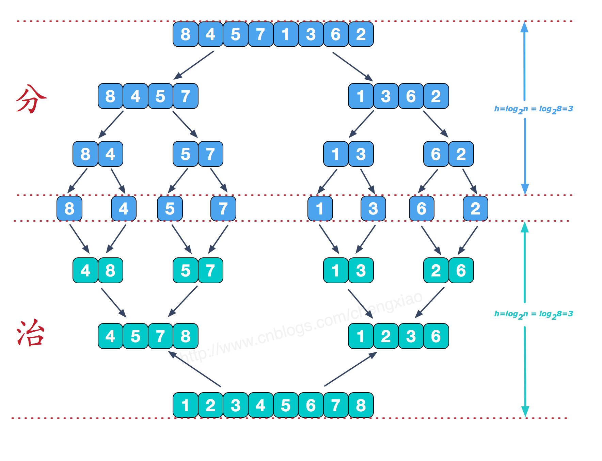

## 递归定义
干什么事,大问题通过范围缩小,并且同等定义的子问题搞定,当把子问题搞定后, 把子问题的结论变成大问题的结论
## 归并排序
1. [图解排序算法(四)之归并排序](https://www.cnblogs.com/chengxiao/p/6194356.html)
2. 
3. 排序思想：
    1. 整体是递归，
    2. 左边排好序+右边排好序+merge让整体有序；
    3. 让其整体有序的过程里用了排外序方法；
    4. 利用master公式来求解时间复杂度；
4. 当然可以用非递归实现。

## 面试题：
### 在一个数组中，一个数**左边**比它小的数的总和，叫做数的小和，所有数的小和累加起来，叫数组小和，求数组小和。
1. 例子：[1,3,4,2,5]，所有的数组的小和为1+1+3+1+1+3+4+2=16。
### 求一个数组中的降序对，例如[3,1,7,0,2]中的降序对为[3,1],[3,0],[3,2],[1,0],[7,0],[7,2]，总共有6个。
1. 这个题不就是看**右边**有多少数字比这个数字小吗？和上面这个面试题很像。

**归并排序的实质**:每一次比较都没有浪费,

## 快速排序
1. 快速排序1.0:在arr[L,R]范围上，进行快速排序的过程：
    1. 用arr[R]对该范围做partition，
        1. ≤arr[R]的数在左部分并且保证arr[R]最后来到左部分的最后一个位置，记为M；
        2. ≥arr[R]的数在右部分(arr[M+1…R])
    2. 对arr[L…M-1]进行快速排序（递归）
    3. 对arr[M+1…R]进行快速排序（递归）
    4. 因为每一次partition都会搞定一个数的位置且不会再变动，所以排序能够完成。

2. 快速排序2.0:在arr[L,R]范围上，进行快速排序的过程：
    1. 用arr[R]对该范围做partition，
        1. <arr[R]的数在左部分；
        2. =arr[R]的数在中间；
        3. >arr[R]的数在右部分
    2. 对arr[L…M-1]进行快速排序（递归）
    3. 对arr[M+1…R]进行快速排序（递归）
    4. 因为每一次partition都会搞定一个数的位置且不会再变动，所以排序能够完成。
3. 快速排序3.0（也就是随机快排）:
    1. 在arr[L,R]范围上，进行快速排序的过程：
    2. 不用arr[R]了，而是随机选择一个数字。
4. 随机快排的时间复杂度分析
    1. 基于Master公式进行分析，得到：划分值越靠近中间，性能越好；越靠近两边，性能越差；
    2. 随机选一个数进行划分的目的就是让好情况和差情况都变成概率事件；
    3. 把每一种情况都列出来，会有每种情况下的时间复杂度，但概率都是1/N；那么所有的情况都进行考虑，时间复杂度就是这种概率模型下的长期期望；
    4. 时间复杂度为O(N*logN)，额外空间复杂度O(logN)都是这么来的。