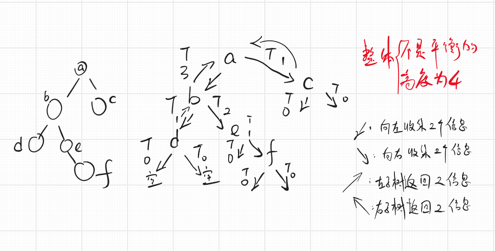
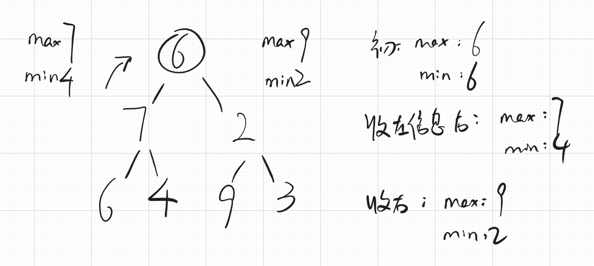

## 23. 合并多个有序链表
1. 题目：https://leetcode.com/problems/merge-k-sorted-lists

2. 核心：小根堆

3. 输入值：一堆头节点组成的链表

4. 过程：

   1. 链表放入后，会把头节点按从小到大的顺序排序（小根堆）。
   2. 弹出时，把头节点指向的下一个数当成头节点，放入，新的头节点会和其他头节点进行比较，自动排序（小根堆）。

5. 代码：
```java
// 比较器：
public static class ListNodeComparator implements Comparator<ListNode> {

    @Override
    public int compare(ListNode o1, ListNode o2) {
        // o1.val < o2.val , 则返回负数，也就是第一个参数在前面，小根堆。
        return o1.val - o2.val;
    }

}
```

```java
// 主函数
public static ListNode mergeKLists(ListNode[] lists) {
    if (lists == null) {
        return null;
    }
    // 使用小根堆，把头挨个塞入，每次弹出后自动塞入头的下一个，进入后自动排序
    // 需要自己写一个ListNode的比较器，也就是：ListNodeComparator
    PriorityQueue<ListNode> heap = new PriorityQueue<>(new ListNodeComparator());
    for (int i = 0; i < lists.length; i++) {
        if (lists[i] != null) {
            heap.add(lists[i]);
        }
    }
    if (heap.isEmpty()) {
        return null;
    }
    ListNode head = heap.poll();
    ListNode pre = head;
    if (pre.next != null) {
        heap.add(pre.next);
    }
    while (!heap.isEmpty()) {
        ListNode cur = heap.poll();
        // 先拿到弹出节点的下一个
        pre.next = cur;
        pre = cur;
        if (cur.next != null) {
            // 如果刚刚弹出的节点的下一个，不是null，那就塞入
            // 小根堆会自己比较
            heap.add(cur.next);
        }
    }
    return head;
}

```


## 100. 判断两棵树是否结构相同

1. 题目:https://leetcode.com/problems/same-tree
2. 代码:
```java
public static boolean isSameTree(TreeNode p, TreeNode q) {
    // 一个为空，一个不为空
    if (p == null ^ q == null) {
        return false;
    }
    // 都是空树 
    if (p == null && q == null) {
        return true;
    }
    // 都不为空
    // 头节点相同，左树相同，右数相同
    return p.val == q.val && isSameTree(p.left, q.left) && isSameTree(p.right, q.right);
}
```

## 101. 判断一棵树是否是镜面树
1. 题目:https://leetcode.com/problems/symmetric-tree
2. 代码:
```java
public static boolean isSymmetric(TreeNode root) {
    return isMirror(root, root);
}

public static boolean isMirror(TreeNode h1, TreeNode h2) {
    // 头节点不会破坏镜面关系
    if (h1 == null ^ h2 == null) {
        return false;
    }
    // 头节点如果是空，自己和自己镜面没问题
    if (h1 == null && h2 == null) {
        return true;
    }
    return h1.val == h2.val && isMirror(h1.left, h2.right) && isMirror(h1.right, h2.left);
}
```
## 104. 返回一棵树的最大深度
1. 题目:https://leetcode.com/problems/maximum-depth-of-binary-tree
2. 代码:
```java
// 以root为头的树，最大高度是多少，返回！
public static int maxDepth(TreeNode root) {
    if (root == null) {
        return 0;
    }
    // 需要返回的高度，是左子树的高度与右子树高度的最大值，并加上根节点的1
    return Math.max(maxDepth(root.left), maxDepth(root.right)) + 1;
}
```

## 105. 用先序数组和中序数组重建一棵树
1. 题目:https://leetcode.com/problems/construct-binary-tree-from-preorder-and-inorder-traversal
2. 秘诀:画递归序的图图,假设具体的例子
3. 代码:
```java
public static TreeNode buildTree1(int[] pre, int[] in) {
    if (pre == null || in == null || pre.length != in.length) {
        return null;
    }
    return f(pre, 0, pre.length - 1, in, 0, in.length - 1);
}

// 有一棵树，先序结果是pre[L1...R1]，中序结果是in[L2...R2]
// 请建出整棵树返回头节点
public static TreeNode f(int[] pre, int L1, int R1, int[] in, int L2, int R2) {
    if (L1 > R1) {
        return null;
    }
    TreeNode head = new TreeNode(pre[L1]);
    if (L1 == R1) {
        return head;
    }
    int find = L2;
    // 遍历行为
    while (in[find] != pre[L1]) {
        find++;
    }
    head.left = f(pre, L1 + 1, L1 + find - L2, in, L2, find - 1);
    head.right = f(pre, L1 + find - L2 + 1, R1, in, find + 1, R2);
    return head;
}
```

```java
public static TreeNode buildTree2(int[] pre, int[] in) {
    if (pre == null || in == null || pre.length != in.length) {
        return null;
    }
    HashMap<Integer, Integer> valueIndexMap = new HashMap<>();
    // 统计中序数组中每个值在哪里
    for (int i = 0; i < in.length; i++) {
        valueIndexMap.put(in[i], i);
    }
    return g(pre, 0, pre.length - 1, in, 0, in.length - 1, valueIndexMap);
}

// 有一棵树，先序结果是pre[L1...R1]，中序结果是in[L2...R2]
// 请建出整棵树返回头节点
public static TreeNode g(int[] pre, int L1, int R1, int[] in, int L2, int R2,
        HashMap<Integer, Integer> valueIndexMap) {
    if (L1 > R1) {
        return null;
    }
    TreeNode head = new TreeNode(pre[L1]);
    if (L1 == R1) {
        return head;
    }
    // 在HashMap表中直接拿出来值，省去了遍历行为
    int find = valueIndexMap.get(pre[L1]);
    head.left = g(pre, L1 + 1, L1 + find - L2, in, L2, find - 1, valueIndexMap);
    head.right = g(pre, L1 + find - L2 + 1, R1, in, find + 1, R2, valueIndexMap);
    return head;
}
```
## 107. 二叉树按层遍历并收集结点
1. 题目:https://leetcode.cn/problems/binary-tree-level-order-traversal-ii/
2. 步骤
   1. 拿出此时队列的size，size有多少个，步骤2重复多少回；
   2. 弹出当前结点，当前结点有左孩子就先将左孩子加入队列，有右孩子再将右孩子加入队列；（先左再右）
3. 代码:
```java
public List<List<Integer>> levelOrderBottom(TreeNode root) {
    // 选择LinkedList比选择ArrayList要好
    List<List<Integer>> ans = new LinkedList<>();
    if (root == null) {
        return ans;
    }
    Queue<TreeNode> queue = new LinkedList<>();
    queue.add(root);
    while (!queue.isEmpty()) {
        int size = queue.size();
        List<Integer> curAns = new LinkedList<>();
        // i<size不能是i<queue.size()，因为queue会变化，是动态的
        for (int i = 0; i < size; i++) {
            TreeNode curNode = queue.poll();
            curAns.add(curNode.val);
            if (curNode.left != null) {
                queue.add(curNode.left);
            }
            if (curNode.right != null) {
                queue.add(curNode.right);
            }
        }
        // System.out.println(ans.toString());
        // LinkedList的add (int index,E e)方法是在某个索引前插入元素E，
        // 先根据索引index找到相应元素，在该元素前添加新元素，
        ans.add(0, curAns);
    }
    return ans;
}
```
## 110. 平衡二叉树
1. 题目:https://leetcode.cn/problems/balanced-binary-tree/
2. 如何判断一颗二叉树是否是平衡二叉树? (二叉树题目 套路)
   1. 每一棵子树的 `|左树高度-右树高度|<=1`
3. 图图解释:
4. 代码:
```java
// 以某个节点为头的时候
// 1. 整棵树是否平衡
// 2. 整棵树的高度是什么
public static class Info {
    public boolean isBalanced;
    public int height;

    public Info(boolean i, int h) {
        isBalanced = i;
        height = h;
    }
}

public static boolean isBalanced(TreeNode root) {
    // 获得根节点两个信息中的isBalanced
    return process(root).isBalanced;
}

public static Info process(TreeNode root) {
    if (root == null) {
        return new Info(true, 0);
    }
    // x!=null
    // 获得左树两个信息
    Info leftInfo = process(root.left);
    // 获得右树两个信息
    Info rightInfo = process(root.right);
    // 获得整棵树的高度：左高与右高的最大值，再+1
    int height = Math.max(leftInfo.height, rightInfo.height) + 1;
    boolean isBalanced = leftInfo.isBalanced && rightInfo.isBalanced
            && Math.abs(leftInfo.height - rightInfo.height) < 2;
    // 把根节点的两个信息返回
    return new Info(isBalanced, height);
}
```
## 98. 验证二叉搜索树
1. 题目: https://leetcode.cn/problems/validate-binary-search-tree/
2. 如何判断一颗二叉树是否是搜索二叉树?
   1. 节点的左子树只包含 小于 当前节点的数。
   2. 节点的右子树只包含 大于 当前节点的数。
   3. 所有左子树和右子树自身必须也是二叉搜索树。
3. 思路:
   1. 如果一个树的中序遍历结果严格递增,那就是有效的搜索二叉树
4. 递归解法:
   1. 左是搜索二叉树;左max<x
   2. 右是搜索二叉树;右min>x
   3. 找出**递归函数同等全**的条件
   4. **每个节点返回三个信息**
      1. 是不是搜索二叉树
      2. max
      3. min
5. 图图解释:
6. 代码:
```java
// 递归函数同等全：都拿到三个信息
public static class Info {
    public boolean isBST;
    public int max;
    public int min;

    public Info(boolean is, int max, int min) {
        isBST = is;
        this.max = max;
        this.min = min;
    }
}

public static boolean IsBinarySearchTree(TreeNode root) {
    return process(root).isBST;
}

public static Info process(TreeNode root) {
    // root == null
    if (root == null) {
        // 可以返回0吗？不行，假如root的值是负数呢？想一下可以吗？
        return null;
    }
    // root != null
    Info leftInfo = process(root.left);
    Info rightInfo = process(root.right);

    // 假如上边有返回null的，这个地方就有压力了，你得解决null的情况呀！
    int max = root.val;
    int min = root.val;
    if (leftInfo != null) {
        max = Math.max(leftInfo.max, max);
        min = Math.max(leftInfo.min, min);
    }
    if (rightInfo != null) {
        max = Math.max(rightInfo.max, max);
        min = Math.max(rightInfo.min, min);
    }
    // 首先我们默认为true；然后我们把所有违规的都列全，赋值为false，最后统一返回就可以。
    // 这些情况有哪些呢？
    // 1. 左树或右树有值的情况：看左树和右树是否满足搜索树的条件、看值是否符合条件。
    // 2. 左树和右树都是null，直接返回true。
    boolean isBST = true;
    if (leftInfo != null && !leftInfo.isBST) {
        isBST = false;
    }
    if (rightInfo != null && !leftInfo.isBST) {
        isBST = false;
    }
    // 判读左树的最大值是否小于root的值。
    boolean leftMaxLessX = leftInfo == null ? true : (leftInfo.max < root.val);
    // 判读右树的最小值是否大于root的值。
    boolean rightMinMoreX = leftInfo == null ? true : (rightInfo.min > root.val);

    if (!leftMaxLessX || !rightMinMoreX) {
        isBST = false;
    }

    return new Info(isBST, max, min);
}
```

## x. 判断是否为平衡搜索二叉树
1. 题目:
2. 代码:
```java
// 可以调两次判断，然后一与就完事了~
```
## 112. 路径总和
1. 题目:https://leetcode.cn/problems/path-sum/
2. 解释:
   1. 路径:从头节点开始,到叶节点结束,才叫做路径
3. 代码:
```java
public static boolean isSum = false;

public static boolean hasPathSum(TreeNode root, int sum) {
    if (root == null) {
        return false;
    }
    isSum = false;
    process(root, 0, sum);
    return isSum;
}

public static void process(TreeNode x, int preSum, int sum) {
    // x是叶节点的时候
    // baseCase：是叶节点的时候 
    // 只关心能不能到所有的叶节点
    // 只有当x是叶节点的时候，才有可能把isSum = true;
    if (x.left == null && x.right == null) {
        if (x.val + preSum == sum) {
            isSum = true;
        }
        // 返回值是void，目的是为了看有没有isSum = true;这个时刻发生
        return;
    }
    // x是非叶节点，即将传值，把自己的值加上
    preSum += x.val;
    if (x.left != null) {
        process(x.left, preSum, sum);
    }
    if (x.right != null) {
        process(x.right, preSum, sum);
    }
}
```

## 113. 路径总和 II
1. 题目:https://leetcode.cn/problems/path-sum-ii/
2. 代码:
```java
public static List<List<Integer>> pathSum(TreeNode root, int sum) {
    List<List<Integer>> ans = new ArrayList<>();
    if (root == null) {
        return ans;
    }
    ArrayList<Integer> path = new ArrayList<>();
    process(root, path, 0, sum, ans);
    return ans;
}

public static void process(TreeNode x, List<Integer> path, int preSum, int sum, List<List<Integer>> ans) {
    // basecase叶节点
    if (x.left == null && x.right == null) {
        if (preSum + x.val == sum) {
            path.add(x.val);
            ans.add(copy(path));
            path.remove(path.size() - 1);
        }
        return;
    }
    // x 非叶节点
    path.add(x.val);
    preSum += x.val;
    if (x.left != null) {
        process(x.left, path, preSum, sum, ans);
    }
    if (x.right != null) {
        process(x.right, path, preSum, sum, ans);
    }
    path.remove(path.size() - 1);
}

public static List<Integer> copy(List<Integer> path) {
    List<Integer> ans = new ArrayList<>();
    for (Integer num : path) {
        ans.add(num);
    }
    return ans;
}

```

## 75. 颜色分类
1. 题目:https://leetcode.cn/problems/sort-colors/
2. 思路:快速排序第二版,分三区,**并且按顺序**
3. 代码:
```java

```

## 912. 排序数组
1. 题目:https://leetcode.cn/problems/sort-an-array/
2. 思路:采用快排.
3. 代码:
```java
public static void swap(int[] arr, int i, int j) {
    int tmp = arr[i];
    arr[i] = arr[j];
    arr[j] = tmp;
}

// arr[L...R]范围上，拿arr[R]做划分值，
// L....R < = >
// 返回的是[L,R]，把小区域的最小坐标和最大坐标返回
public static int[] partition(int[] arr, int L, int R) {
    int lessR = L - 1;
    int moreL = R;
    int index = L;
    while (index < moreL) {
        if (arr[index] < arr[R]) {
            // 当前值和小于区的下一个交换，小于区向右扩
            swap(arr, ++l`essR, index++);
        } else if (arr[index] > arr[R]) {
            // 当前值和大于区的前一个交换，大于区向左扩
            swap(arr, --moreL, index);
        } else {
            index++;
        }
    }
    // 最后一个数，也就是划分值，归位
    swap(arr, moreL, R);
    // 小于区的最后一个+1，划分值归位的位置
    return new int[]{lessR + 1, moreL};
}

// quickSort 递归版本
public static int[] quickSort1(int[] arr) {
    if (arr == null || arr.length < 2) {
            return arr;
    }else{
        process(arr, 0, arr.length - 1);
    }
    return arr;
}

public static void process(int[] arr, int L, int R) {
    if (L >= R) {
        return;
    }
    int[] equalE = partition(arr, L, R);
    // euqalE[0] 等于区域的第一个数
    // euqalE[1] 等于区域的最后一个数
    process(arr, L, equalE[0] - 1);
    process(arr, equalE[1] + 1, R);
}

```

## x. ...
1. 题目:
2. 代码:
```java

```

## x. ...
1. 题目:
2. 代码:
```java

```

## x. ...
1. 题目:
2. 代码:
```java

```

## x. ...
1. 题目:
2. 代码:
```java

```

## x. ...
1. 题目:
2. 代码:
```java

```

