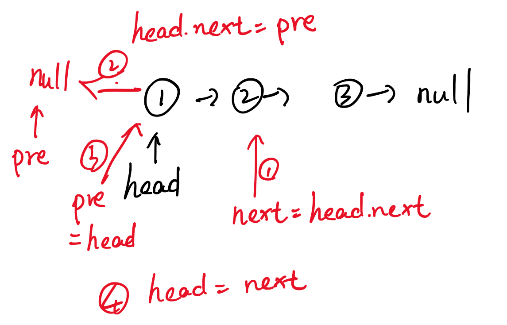
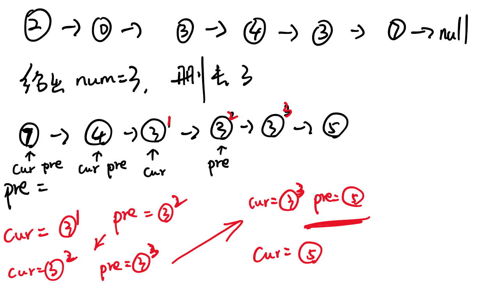
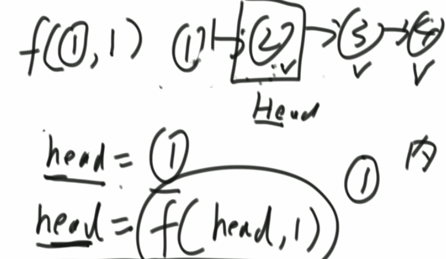
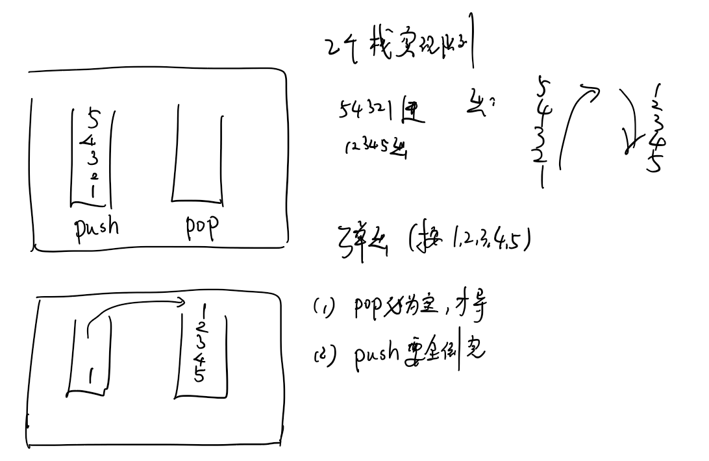
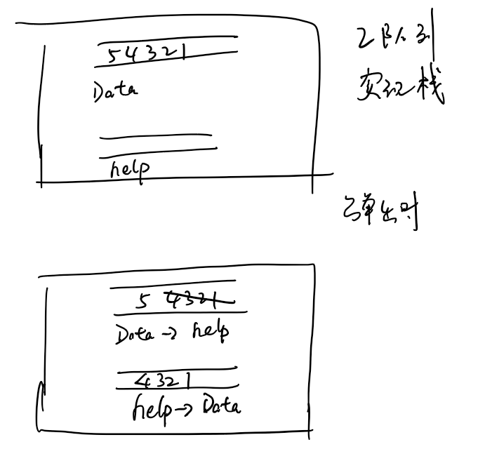
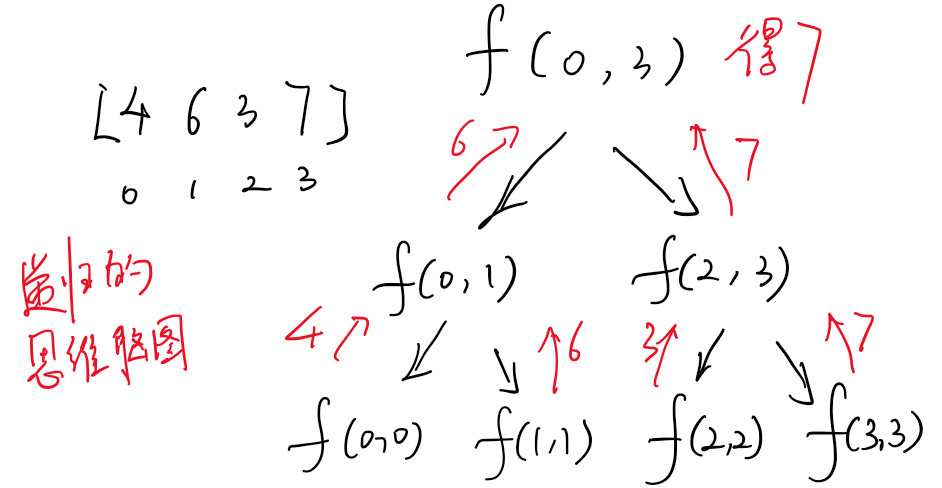
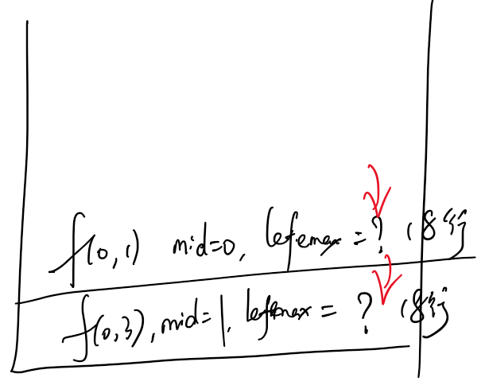
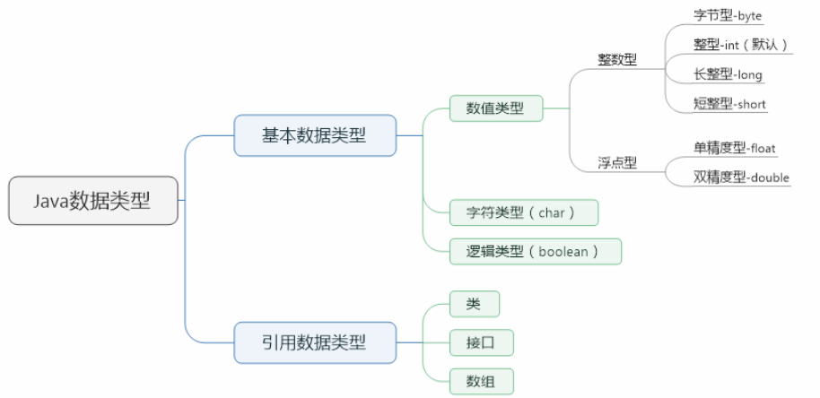

## 链表结构
1. 单向链表的定义
```java
public class Node{
    public int value;
    public Node next;

    public Node(int data){
        value = data;
    }
}
```
2. 双向链表的定义
```java
public class DoubleNode{
    public int value;
    public Node last;
    public Node next;

    public DoubleNode(int data){
        value = data;
    }
}
```
3. 单向链表和双向链表最简单的练习:链表相关的题基本上都是coding的题
    1. 单链表和双链表的逆序问题
```java
public static Node reverseLinkedList(Node head) {
    Node pre = null;
    Node next = null;
    while (head != null) {
        next = head.next;
        head.next = pre;
        pre = head;
        head = next;
    }
    return pre;
}
```
    2. 删除单链表中的某个数字问题
```java
// head = removeValue(head, 2);
public static Node removeValue(Node head, int num) {
    // head来到第一个不需要删的位置
    while (head != null) {
        if (head.value != num) {
            break;
        }
        head = head.next;
    }
    // 1 ) head == null
    // 2 ) head != null
    Node pre = head;
    Node cur = head;
    while (cur != null) {
        if (cur.value == num) {
            pre.next = cur.next;
        } else {
            pre = cur;
        }
        cur = cur.next;
    }
    return head;
}

```


## 扩展：Java的代码也会产生内存泄露。JVM会怎样释放空间？
1. 如果你现在正在生存某个变量或者正在引用某个变量，JVM不会把这个变量释放掉，
2. 如果JVM找不到活着的引用的内存，JVM会把它释放（如下图所示，即便你没有把1杀死，也没有把1→2的引用去除，JVM会认为，你再怎么也无法到达1，就会自动帮助你毁灭）。


## 栈和队列
1. 既然语言都有这些结构和api，为什么还需要手撸练习？
    1. 算法问题无关语言；
    2. 语言提供的api是有限的，当有新的功能是api不提供的，就需要改写；
    3. 任何软件工具的底层都是最基本的算法和数据结构，这是绕不过去的。
2. 栈：先进后出
3. 队列：先进先出
4. 怎么实现这两种逻辑结构呢？
    1. **利用双链表结构实现**
    2. **利用数组结构实现**
5. **栈和队列的常见面试题**
### 1. 怎么用数组实现不超过固定大小的队列和栈？
1. 栈：正常使用；
2. 队列：环形数组。
```java
// 双向链表的节点类型
public static class Node<T> {
    public T value;
    public Node<T> last;
    public Node<T> next;

    public Node(T data) {
        value = data;
    }
}
```
```java
// 双向链表
public static class DoubleEndsQueue<T> {
    public Node<T> head;
    public Node<T> tail;

    // 头部添加
    public void addFromHead(T value) {
        Node<T> cur = new Node<T>(value);
        if (head == null) {
            head = cur;
            tail = cur;
        } else {
            cur.next = head;
            head.last = cur;
            head = cur;
        }
    }

    // 尾部添加
    public void addFromBottom(T value) {
        Node<T> cur = new Node<T>(value);
        if (head == null) {
            head = cur;
            tail = cur;
        } else {
            cur.last = tail;
            tail.next = cur;
            tail = cur;
        }
    }

    // 头部删除
    public T popFromHead() {
        if (head == null) {
            return null;
        }
        Node<T> cur = head;
        if (head == tail) {
            head = null;
            tail = null;
        } else {
            head = head.next;
            cur.next = null;
            head.last = null;
        }
        return cur.value;
    }

    // 尾部删除
    public T popFromBottom() {
        if (head == null) {
            return null;
        }
        Node<T> cur = tail;
        if (head == tail) {
            head = null;
            tail = null;
        } else {
            tail = tail.last;
            tail.next = null;
            cur.last = null;
        }
        return cur.value;
    }

    public boolean isEmpty() {
        return head == null;
    }

}
```
   
### 2. 实现一个特殊的栈，在基本功能的基础上，再实现返回栈中最小元素的功能。pop、push、getMin操作的时间复杂度都是O(1)，设计的栈类型可以使用现成的栈结构。
1. 两个栈, `data栈` 和 `min栈`,每次塞入数时,data栈正常加入,min栈:塞入数和min栈顶比较,谁小加谁.
2. 弹出:每次同步弹出data栈和min栈
3. min栈记录了每一个level情况下,最小值是什么
```java
// 1. 两个栈, `data栈` 和 `min栈`,每次塞入数时,data栈正常加入,min栈:塞入数和min栈顶比较,谁小加谁.
// 2. 弹出:每次同步弹出data栈和min栈
// 3. min栈记录了每一个level情况下,最小值是什么
public static class MyStack2 {
    private Stack<Integer> stackData;
    private Stack<Integer> stackMin;

    public MyStack2() {
        this.stackData = new Stack<Integer>();
        this.stackMin = new Stack<Integer>();
    }

    public void push(int newNum) {
        if (this.stackMin.isEmpty()) {
            this.stackMin.push(newNum);
        } else if (newNum < this.getmin()) {
            this.stackMin.push(newNum);
        } else {
            int newMin = this.stackMin.peek();
            this.stackMin.push(newMin);
        }
        this.stackData.push(newNum);
    }

    public int pop() {
        if (this.stackData.isEmpty()) {
            throw new RuntimeException("Your stack is empty.");
        }
        this.stackMin.pop();
        return this.stackData.pop();
    }

    public int getmin() {
        if (this.stackMin.isEmpty()) {
            throw new RuntimeException("Your stack is empty.");
        }
        return this.stackMin.peek();
    }
}

```

            1. 两个栈, `data栈` 和 `min栈`,每次塞入数时,data栈:正常加入,min栈:塞入数>min栈顶,不压入,否则压入
            2. 弹出:只有data当前要弹出的数和min栈中栈顶相同时会弹出
            3. min栈记录了每一个level情况下,最小值是什么
### 3. 如何用栈结构实现队列结构？


### 4. 如何用队列结构实现栈结构？



### 图图
0. 图:  
    1. 宽度遍历:队列  
    2. 深度遍历:栈

1. 怎么用栈来实现**图的宽度遍历**
    1. 两个队列拼成一个栈
2. 怎么用队列来实现**图的深度遍历**
    1. 两个栈拼成一个队列


## 递归行为
    1. 怎么从思想上理解递归？
        1. 大事分解为若干件小事,把每一个小事的答案求出来,小事的答案通过决策过程得到大事的答案
    2. 怎么从实际实现的角度出发理解递归？
        1. 不管是什么递归,都画出脑图
### 例题
### 求数组arr[L...R]中的最大值,怎么用递归方法实现
递归思想:
1. 将[L...R]分成左右两半
    1. 左:[L...Mid]
    2. 右:[Mid+1...R]
2. **递归的时间复杂度的经验公式**两个条件：
    1. 子问题的规模一致；
    2. 常数项规模可以表达为O(N^d)）
    3. 推导：a表示子问题调动了a次，N/b表示子问题的规模。
3. 左部分求最大值,右部分求最大值
4. [L...R]范围上的最大值,是max{左部分最大值,右部分最大值}


利用系统栈:底层就是说每次递归都会把需要的子递归放到栈顶,拿到值后,再往回走(所有递归行为都能改成非递归行为)

## 哈希表
1. HashMap有key有value
2. HashSet有key
3. int double float **按值传递**
    1. 当发现是这些数据类型时,==进行比较的是**值**
4. Integer Double Float **按引用传递**
    1. 当发现是这些数据类型时,==进行比较的是**地址**
    2. `.euqals()`进行比较的是**值**
    3. `-128~127`进行比较的是**值**
5. 哈希表:
    1. 无论遇到什么都是**按值传递**
    2. 非基础类型:**引用传递**

5. 哈希表，增、删、改、查，在使用时，O(1)

## 有序表:TreeMap,时间复杂度O(log(N))
1. 可以乱序塞入,但是他内部会自己排序
    1. `.firstKey()`
    2. `.lastKey()`
    3. `.floorKey(5)`:小于等于5,并且离5最近的
    4. `.ceilingKey(5)`:大于等于5,并且离5最近的